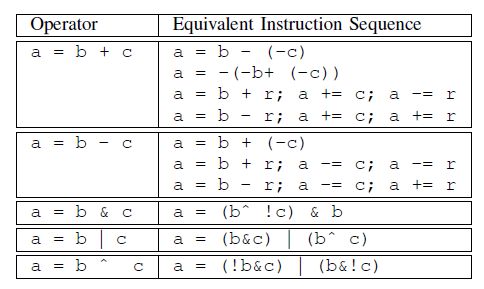

# 自制Ollvm

原本网上没有多少开源的代码混淆器，现在却发现学习OLLVM的人特别多，很多人也有自己的混淆器。

汇编的混淆和LLVM还是挺有意思的。虽然这个项目的进度依然停滞在只学完简单运算混淆的地步，但有时间我应该会回来继续。

<!-- more -->

ollvm/armariris/hikari 三个一起学习.
[ollvm/armariris/hikari 适配llvm10](https://www.leadroyal.cn/?p=1072) 

http://mayuyu.io/ 这里有很多关于llvm的

https://iosre.com/t/llvm/10610/39 实现字符串加密

llvm提供了很方便地操作二进制代码的api. 自己移植不一定有利于学习, 移植主要解决的是llvm版本更新的各种杂七杂八的变化, 反而那些主要的逻辑不要求理解. 

既然是学习，就好好以LLVM的字节码为基础，而不是看最终的机器码汇编了。


计划: 
1. 作为使用者, 使用这几个代码混淆器, 成功编译混淆代码(使用移植好到llvm10的代码)
2. 作为开发者, 学习混淆的原理, 学习代码编写的思路, 熟悉llvm的api.
3. 开始考虑混淆的对策


TODO:
1. 如何自己打开自己的
2. 找合适的软件或者片段，调用我的ollvm。
3. 可视化、或者如何方便查看llvm字节码，甚至生成的机器码

和godbolt结合可视化。


TODO:

1. 学习llvm中的Annotation
2. 编译debug版本，配好调试环境，方便gdb源码调试
3. 分析opt怎么通过RegisterPass<HelloPass>增加的命令行选项。看看clang是怎么管理和加载Pass的。
4. 探索Windows下llvm的pass的现状
5. 改下代码格式化的格式，看看怎么把大括号不单独起一行。
6. 指令替换方面把llvm的全加进来，改用llvm的随机化函数。
7. 学学C++的匿名函数的具体原理。闭包，捕获什么的具体规则和实现


[toc]


## 杂谈

-m64 选项生成64位的代码，但是int还是32位大小的。long才是64位大小的。似乎没有选项能让int变成64位大小的。而main函数的返回值因此也是32位的

读取函数的Annotation上，ollvm可能还是比较猛的？搜`llvm readAnnotate` 炸出一大片分析ollvm的。


## 常用的命令

```
opt -load lib/LLVMHello.so -help
```

```
opt -load lib/LLVMHello.so -hello < hello.bc > out.bc
```

```
clang -Xclang -load -Xclang Obfuscation.dll
```

```
clang -c -emit-llvm $1.c #生成bc
clang -S -emit-llvm $1.c #生成.ll的文本形式
```


## 如何编写pass

要运行的代码是 https://github.com/LeadroyaL/llvm-pass-tutorial , 这里每个项目是单独的文件夹. 三个项目合在一起, 共用外面的cmake文件. 为了明白这个移植怎么跑起来, 学习源码外的pass项目的建立. 先学下面的项目, 配置好路径.
[pass-skeleton](https://github.com/abenkhadra/llvm-pass-tutorial) 

[如何写一个pass llvm.org](https://llvm.org/docs/WritingAnLLVMPass.html) 
确实, 写一个pass就真的是一个pass, 出来一个so文件, 在passmanager里过一遍llvm bytecode. pass的加载和运行暴露在命令行选项. 

1. pass项目可以单独在源码外

编译的时候需要在 `[LLVM_DIR]` 找到llvm的配置. 该项目骨架会通过 `$LLVM_HOME` 环境变量设置好 `[LLVM_DIR]` 
编译出来可以使用opt直接运行pass. 也可以clang编译的时候指定opt加载这个so文件, 然后加上调用so的选项.

```bash
clang-7.0 -Xclang -load -Xclang build/skeleton/libSkeletonPass.* something.c$
```

2. pass项目在llvm源码内

可以像他们几个项目一样直接在llvm-project源码内的 `/lib/Transform` 修改. 并且修改默认加载这个pass, 只需要给出使用的选项.

### 源码外的pass

[Developing LLVM passes out of source](http://llvm.org/docs/CMake.html#developing-llvm-passes-out-of-source) 

LLVM_HOME 应该是 `/usr/lib/llvm-10`, 这样就会设置LLVM_DIR为 `/usr/lib/llvm-10/lib/cmake/llvm` LLVM_DIR里面有LLVMConfig.cmake, 设置了这个环境变量, cmake中调用 `find_package(LLVM REQUIRED CONFIG)` 就可以找到llvm作为一个cmake的library

为了构建源码外的pass, 重要的cmake语句有
```
cmake_minimum_required(VERSION 3.4)
project(llvm-pass-tutorial)

find_package(LLVM REQUIRED CONFIG)
add_definitions(${LLVM_DEFINITIONS})
include_directories(${LLVM_INCLUDE_DIRS})
link_directories(${LLVM_LIBRARY_DIRS})

add_subdirectory(skeleton)  # Use your pass name here.
add_subdirectory(ollvm)  # ollvm
add_subdirectory(Hikari)  # Hikari
add_subdirectory(Armariris)  # Armariris
```
在每个文件夹内的CMakeList里调用 `add_library`
```
add_library(Armariris MODULE
        # List your source files here.
        CryptoUtils.cpp
        StringObfuscation.cpp
        Substitution.cpp
        Flattening.cpp
        Utils.cpp
        include/Transforms/Obfuscation/Flattening.h
        include/Transforms/Obfuscation/StringObfuscation.h
        include/Transforms/Obfuscation/Substitution.h
        include/Transforms/Obfuscation/Utils.h
        Enter.cpp
        )
```


### 行动

为了避免编译llvm. 我采用直接apt安装的方式安装llvm, 源码外建立pass项目.
好像安装了llvm-dev
安装后在 `/usr/lib/llvm-10` 附近有各种编译头文件

在`project(llvm-pass-tutorial)`之后加上

```
set(ENV{LLVM_HOME} /usr/lib/llvm-10)
```


### pass的集成

我想知道如何无缝集成到clang。

新的passmanager能更细粒度地控制Pass之间的互斥关系。每一个函数都返回了对应invalidate了的其他pass。还没迁移过去。所以可能还是legacy的PM多一些，clang应该还是吧。而legacy的PM，这两种注册方法中

1. 要有一个ID，初始值不重要，因为是根据ID的地址区别各个函数的。

   ```
   char Hello::ID = 0;
   ```

2. 注册pass，得到一个命令行。这里是通过构造函数注册的，我们只需要初始化一个类。这种方法似乎只对opt有效？？当有这个选项的时候我们的pass才会被加载

   ```
   static RegisterPass<Hello> X("hello", "Hello World Pass",
                                false /* not modify CFG */,
                                false /* pure Analysis Pass */);
   ```

   这种方法会注册到全局的passRegistry里面。TODO：探索何时被注册了命令行选项。

3. 加载时自动注册，这里用的是匿名函数，我们可以写一个函数。这种方法对opt无效。对`clang -Xclang -load -Xclang Obfuscation.dll` 有效。

   ```
   static RegisterStandardPasses Y(
       PassManagerBuilder::EP_EarlyAsPossible,
       [](const PassManagerBuilder &Builder,
          legacy::PassManagerBase &PM) { PM.add(new Hello()); });
   ```

   TODO：研究原理。它会先调用PassManagerBuilder::addGlobalExtension，这个函数则是Transform/IPO里的，它把`std::make_tuple(Ty, std::move(Fn), ExtensionID)` 放到GlobalExtensions这个static全局Vector里面。最终是populateFunctionPassManager这里把注册的这些东西放进FPM的

   怀疑可能这里把我们的Pass放进内部统一的“Pass数据库”里了，opt根据数据库生成命令行选项，每个选项对应一个Pass的启用和关闭。

4. 命令行选项，加载后通过参数更详细地控制pass 

   https://stackoverflow.com/questions/13626993/is-it-possible-to-add-arguments-for-user-defined-passes-in-llvm

   https://llvm.org/docs/CommandLine.html#commandline-2-0-library-manual

   使用commandline api: ​cl::opt。这个工具是完全独立于llvm的，可以拿出来自己用。

   ```cpp
   int main(int argc, char **argv) {
     cl::ParseCommandLineOptions(argc, argv);
     ...
   }
   ```

   它负责初始化全局变量，选项都反映在全局变量里。因此和opt、clang是否加载使用我们的pass没有关系。

   ```
   static cl::opt<int>
   ObfProbRate("bcf_prob", cl::desc("Choose the probability [%] each basic blocks will be obfuscated by the -bcf pass"), cl::value_desc("probability rate"), cl::init(defaultObfRate), cl::Optional);
   ```

   表示解析一个int类型的命令行

   ```cpp
   cl::opt<RegisterMyPasses::FunctionPassCtor, false,
           RegisterPassParser<RegisterMyPasses> >
   MyPassOpt("mypass",
             cl::init(&createDefaultMyPass),
             cl::desc("my pass option help"));
   ```

   **llvm::cl\::opt< DataType, ExternalStorage, ParserClass >** 这里的cl初始化，声明了一个自定义parser，parser返回的结果是RegisterMyPasses类型的命令行选项。

5. [Registering dynamically loaded passes](https://llvm.org/docs/WritingAnLLVMPass.html#id47) 

6. 


### ubuntu的pass测试

为了方便地测试pass，方便地看到结果。输入是c语言的程序，输出pass前和pass后的llvm ir。

使用makefile文件

```makefile
%.ll: %.c
	clang -S -emit-llvm $^

%.obf.ll: %.ll
	opt -stats -S -load ../build/myobf/libmyobf.so -hello $^ -o $@
```


## LLVM的Annotation

### 资料搜寻

https://groups.google.com/g/llvm-dev/search?q=llvm.global.annotations

https://groups.google.com/g/llvm-dev/c/IiuO8EOM6dI/m/nQdjQ1qOYIgJ

通过google groups搜索mailing list，最终找到了用法的讨论。在08年的时候有个AnnotationManager，之后被删掉了。2020年11月最近似乎增加了!annotate的新用法，对旧的__attribute\_\_((annotate)) 用法可能也做了什么处理？

有些东西可能真的就没有文档。。。？？仔细学习后我发现我的想法错了，可能只是因为用法没有什么特殊的地方，所以不需要单独成文档。最后只是靠看各种其他文档弄懂的，llvm的mailing list反而用处不大。

主要靠的是：llvm的struct、array类型，getElementPtr指令（复杂结构体的地址计算指令），bitcast指令（类似强制类型转换）

### IR解析

tl;dr 全局变量，包括函数的Annotation被放在llvm.global.annotations这个全局变量里。局部变量、函数参数的annotation会产生对[llvm.var.annotation](https://llvm.org/docs/LangRef.html#llvm-var-annotation-intrinsic)这个函数的call指令，相关信息放在函数参数里。

数组类型为`{ i8*, i8*, i8*, i32 }`，类似于`{char*, char*, char*, int}` 依次为 函数地址、annotation字符串地址、源码文件名、源码内的行号。

对参数的annotate会转化为有内存空间的局部变量，然后对内存空间annotate。此外，因为每个函数的局部空间是通过alloca指令分配的，所以llvm.var.annotation的第一个参数会指向分配的内存空间内部。局部变量的变量名会丢失。

可能通过Debug_info能够找回局部变量名？增加-g选项后生成的ll文件内确实会增加dwarf4信息。会通过`call void @llvm.dbg.declare(metadata i32* %2, metadata !14, metadata !DIExpression()), !dbg !15`的方式声明局部变量，需要分析一下变量。通过`!llvm.module.flags` 可以判断是否开启了debug。

```c
// Annotation.c

int a __attribute__((annotate(("hello1")))) = 3;

int b(int __attribute__((annotate(("hello2")))) c)
{
  return c + 41;
}

int d(int e) __attribute__((annotate(("hello"))))
{
  return e + 42;
}
```

```llvm
; ModuleID = 'Annotation.c'
source_filename = "Annotation.c"
target datalayout = "e-m:e-p270:32:32-p271:32:32-p272:64:64-i64:64-f80:128-n8:16:32:64-S128"
target triple = "x86_64-pc-linux-gnu"

@a = dso_local global i32 3, align 4
@.str = private unnamed_addr constant [7 x i8] c"hello1\00", section "llvm.metadata"
@.str.1 = private unnamed_addr constant [13 x i8] c"Annotation.c\00", section "llvm.metadata"
@.str.2 = private unnamed_addr constant [7 x i8] c"hello2\00", section "llvm.metadata"
@.str.3 = private unnamed_addr constant [6 x i8] c"hello\00", section "llvm.metadata"
@llvm.global.annotations = appending global [2 x { i8*, i8*, i8*, i32 }] [{ i8*, i8*, i8*, i32 } { i8* bitcast (i32* @a to i8*), i8* getelementptr inbounds ([7 x i8], [7 x i8]* @.str, i32 0, i32 0), i8* getelementptr inbounds ([13 x i8], [13 x i8]* @.str.1, i32 0, i32 0), i32 3 }, { i8*, i8*, i8*, i32 } { i8* bitcast (i32 (i32)* @d to i8*), i8* getelementptr inbounds ([6 x i8], [6 x i8]* @.str.3, i32 0, i32 0), i8* getelementptr inbounds ([13 x i8], [13 x i8]* @.str.1, i32 0, i32 0), i32 10 }], section "llvm.metadata"

; Function Attrs: noinline nounwind optnone uwtable
define dso_local i32 @b(i32 %0) #0 {
  %2 = alloca i32, align 4
  store i32 %0, i32* %2, align 4
  %3 = bitcast i32* %2 to i8*
  call void @llvm.var.annotation(i8* %3, i8* getelementptr inbounds ([7 x i8], [7 x i8]* @.str.2, i32 0, i32 0), i8* getelementptr inbounds ([13 x i8], [13 x i8]* @.str.1, i32 0, i32 0), i32 5)
  %4 = load i32, i32* %2, align 4
  %5 = add nsw i32 %4, 41
  ret i32 %5
}

; Function Attrs: nounwind willreturn
declare void @llvm.var.annotation(i8*, i8*, i8*, i32) #1

; Function Attrs: noinline nounwind optnone uwtable
define dso_local i32 @d(i32 %0) #0 {
  %2 = alloca i32, align 4
  store i32 %0, i32* %2, align 4
  %3 = load i32, i32* %2, align 4
  %4 = add nsw i32 %3, 42
  ret i32 %4
}
```

llvm.global.annotations的声明中，最开头的`[2 x { i8*, i8*, i8*, i32 }]`是类型，紧接着的是主体，ConstantExpr，最末尾是section说明`, section "llvm.metadata"`。

而ConstantExpr部分就利用bitcast把函数类型转换成i8*类型`bitcast (i32* @a to i8*)`，再`getelementptr inbounds ([7 x i8], [7 x i8]* @.str, i32 0, i32 0)`。

### Pass中的解析方法

首先获取Module级别的全局变量 llvm.global.annotations 

```
GlobalVariable *glob =
      f->getParent()->getGlobalVariable("llvm.global.annotations");
```

得到全局变量的初始值

```
ConstantArray *ca = dyn_cast<ConstantArray>(glob->getInitializer())
```

这是一个数组类型，先进行遍历，长度是`ca->getNumOperands()`，取下标使用`ca->getOperand(i)`。取了后得到ConstantStruct。

```
ConstantStruct *structAn = dyn_cast<ConstantStruct>(ca->getOperand(i))
```

这就是`{ i8*, i8*, i8*, i32 }`结构体，使用`structAn->getOperand(0)`这样的方法取0-3的下标得到成员。其中前三个取出来都是ConstantExpr：

```
ConstantExpr *expr = dyn_cast<ConstantExpr>(structAn->getOperand(0))
ConstantExpr *note = cast<ConstantExpr>(structAn->getOperand(1));
```

第一个基本上都是bitcast

```
expr->getOpcode() == Instruction::BitCast 
expr->getOperand(0)是Function类型
```

第二第三个都是getElementPtr，然后先获取GlobalVariable类型的字符串，再获取Initializer得到真正的字符串内容。

```
note->getOpcode() == Instruction::GetElementPtr
GlobalVariable *annoteStr = dyn_cast<GlobalVariable>(note->getOperand(0))
ConstantDataSequential *data = dyn_cast<ConstantDataSequential>(annoteStr->getInitializer())
if (data->isString()) { annotation += data->getAsString().lower() + " "; }
```

### AnnotationHello 在Pass中读取Annotation实例

继承一个ModulePass，对每个模块解析一次Annotation。


继承一个FunctionPass函数，在第一个基本块内解析Annotation。


TODO：能否（简单地）一个命令行开启两个Pass？呃，那个Register决定opt是否启用，而


## Windows平台下的混淆：visual studio 配置使用pass

经过查阅资料, 没找到, 不能android一样, 
[重新编译才能得到cmake库](https://stackoverflow.com/questions/48947973/use-llvm-in-a-cmake-build) 
编译后将build文

在Windows平台编译不是一个简单的问题，需要各种支持。现在虽然难，但似乎有人成功了。

安装了tdm-Gcc之后用如下的选项编译

```
cmake -G Ninja -DLLVM_ENABLE_PROJECTS="clang" -DLLVM_EXPORT_SYMBOLS_FOR_PLUGINS=On ..\llvm
```

出现报错，说

cant close file too big

改设置上一些其他的选项试试，看看能不能好一点。可能只能编译release版本的

```
cmake -G Ninja -DLLVM_ENABLE_PROJECTS="clang" -DLLVM_EXPORT_SYMBOLS_FOR_PLUGINS=On -DLLVM_INCLUDE_TESTS=Off DLLVM_TARGETS_TO_BUILD="X86" -DCMAKE_BUILD_TYPE=Release ..\llvm
```

时间过于漫长，我把环境变量里面的clang提前了，不行的话看看能不能clang自己编译自己。

TODO 描述编译经历

1. 坚持使用MSVC编译，使用MSVC自带的开发控制台的x64 native tools
2. 使用上面的方法后，即使用Ninja生成器，不加-hHost=x64，也能正确用上64位的toolchain好像
3. 源码内pass比源码外pass更容易配

现在是windows平台，in source编写pass。如果做成DLL，则不能集成进clang里，这样visual studio不好调用。


### 编写混淆pass

1. 自己编写的pass编译成dll之后是否只能通过opt运行？不能通过clang自动运行？

   [这里](https://www.cs.cornell.edu/~asampson/blog/clangpass.html) 其实是一种挺Hack的方法，让组件加载dll/so的时候去注册，我在windows上这样加载LLVMHello.dll 会报错 `动态链接库(DLL)初始化例程失败。 (0x45A)` 

   首先写一个bat自动化进行编译成中间代码和使用pass的过程。

   一种方法是源码内编写pass，直接修改相关代码加载pass，这种方法其实挺不容易的，我首先在clang的一些cmakelist里加入了Hello链接进去，但是似乎还是需要注册？需要继续深入了解研究看看源码，看问题4 [内置的方法](https://medium.com/@mshockwave/writing-llvm-pass-in-2018-part-iv-d69dac57171d) 

   否则即使在源码内编写，也出来的是动态库，还是只能opt加载。。。

2. 头文件缺失的问题怎么解决？visual studio是怎么编译的？

   visual studio 最近有了llvm支持。而我自己编译的llvm是没有基本的C++头文件的。用微软的安装包安的clang也是一样，所以可能是手动添加了include路径？

3. llvm的pass是如何注册命令行选项的？怎样编译成dll，又如何不出dll而是内置到clang里？

   想要内置考虑可以通过[llvm plugin](https://llvm.org/docs/WritingAnLLVMPass.html#building-pass-plugins)。是否编译成dll和Transform里的自己的pass的CmakeList里的add_llvm_library 里是否加上Module参数有关系。加上就是动态链接，不加上就是静态链接出来。

4. Transform的那些pass是怎么加载进clang里的？

   lib/CodeGen/CMakeList.txt

   tools/driver/CMakeList.txt

   这两个地方有clang会link进去的东西。

   要去掉自己的MODULE BUILDTREE_ONLY

   我编译进去了，但是好像不太行。。 
   
   好像要在IPO的PassManagerBuilder::populateFunctionPassManager/populateModulePassManager
   
    [内置的方法](https://medium.com/@mshockwave/writing-llvm-pass-in-2018-part-iv-d69dac57171d) 

5. bytecode转可执行文件？

   可以直接clang编译成可执行文件 [来源](https://blog.csdn.net/pc153262603/article/details/89553688)

   ```
   clang a.o.bc -o struct
   ```

   首先llc编译成S的汇编文件，再用gcc什么的生成可执行文件 [来自](https://stackoverflow.com/questions/32523847/how-to-make-llvm-bc-file-executable) 

   ```
   llc -filetype=obj hello.bc -o hello.o
   llc hello.bc -o hello.s
   gcc hello.o/s -o hello
   ```


## PASS与Clang的集成

### 案例: ollvm做出的修改

以下是ollvm4.0和llvm4.0进行对比的不同的文件. 来自[这里](https://magic-king.net/2020/02/27/ollvm-learning/) 使用[Diffinity](https://truehumandesign.se/s_diffinity.php). 

```
./include/llvm/Transforms/Obfuscation/ # obfuscation的头文件
./include/llvm/Transforms/CryptoUtils.h # obfuscation的头文件
./lib/Transforms/IPO/LLVMBuild.txt
./lib/Transforms/IPO/PassManagerBuilder.cpp # Pass注册
./lib/Transforms/Obfuscation/ # obfuscation source code
./lib/Transforms/CMakeLists.txt
./lib/Transforms/LLVMBuild.txt
./tools/clang # 集成clang,要在gitignore里取消clang的注释
./.gitignore
./CMakeLists.txt
./CODE_OWNERS.TXT
./LICENSE.TXT
```


## OLLVM 实现分析

### 概述

1. **Instruction substitution:** 将加减与或异或这几个指令通过数学方式变成更复杂但等效的计算。
2. **Bogus Control Flow** 将一个基本块的入口加上虚假分支语句，不会执行的分支指向虚假代码。再在出口加上虚假分支，不会执行的分支指向虚假代码，最后将虚假基本块的出口指向真实基本块，构成类似循环的结构。
3. **Control Flow Flattening** 把整个函数的控制流都收到路由变量和分发块的逻辑里来，类似于switch case。（是不是可以直接做源码级的混淆）更进一步，可以让CRC代码完整性检查的结果参与进来，这样如果代码的CRC不对，就直接影响跳转的逻辑。（但是只有在完全编译链接生成最终的可执行文件的时候才能确定CRC。而如果CRC检查部分的代码是相互依赖的（检查到其他检查部分的代码），则还需要解决依赖关系（利用CRC的线性代数的线性性质））
4. **Basic-block splitting** 这是什么？直接增加虚假分支和基本块？
5. **Code Tamper-Proofing** 有多个check例程，往正常逻辑中插入对它的调用，然后检查值对不对。通过融合进控制流的方法，如果CRC不对的话则之后不会跳转到正确的基本块。
6. **Procedures Merging** 将多个函数合并成一个merged函数，第一个参数用来判断调用的是哪个函数，通过switch case调用对应的函数。原来的函数被wrapper函数替代，使用varg技术像，merged函数提供正确的参数，再跳转到对应的函数。（如果能在链接时处理，则甚至不需要wrapper函数，而是修改每个调用前push参数的过程增加调用号。）merged函数被其他混淆（如控制流平坦化）处理后能大幅增加抗分析能力。此外这种方法还能防止不分析的情况下直接重用汇编的攻击。

未来的方向： 特定于平台的反调试代码，对密码学常量和字符串的混淆，代码水印技术


### Instruction substitution

指令替换是最简单的。对于加减与或 异或这五种运算，分别有多种替换方法，ollvm随机选一个替换。增加的命令行选项是每个函数替换多少遍。第一遍替换的是原始的指令，后面每次替换的就是混淆后的指令了，通过反复替换增加复杂度。

这个pass明显需要放在优化pass之后。如何让自己的pass在优化后运行？ 可以考虑opt过了pass之后，编译的时候就用 -O0 ?

继承Funcpass的Substitution有几个函数指针数组，在初始化的时候把自己的成员函数填进去，之后通过随机数产生器随机调用。

```cpp
    for (Function::iterator bb = tmp->begin(); bb != tmp->end(); ++bb) {
      for (BasicBlock::iterator inst = bb->begin(); inst != bb->end(); ++inst) {
        if (inst->isBinaryOp()) {
          switch (inst->getOpcode()) {
          case BinaryOperator::Add:
                      break;
          case BinaryOperator::Sub:
          ...
```

真正核心的替换函数，参数只是那个指令`BinaryOperator *bo`。



addNeg：增加一个Neg指令，把加法变成减法。addDoubleNeg同理。

精髓在于BinaryOperator::Create的方法的最后一个参数是InsertBefore，这样按顺序插入到那个指令前面，最后的时候再对原来的指令调用replaceAllUsesWith，用最后生成的指令去替换它就好了。意味着用最后一个指令产生的值去替换它产生的值。

binaryOperator成员如下，rem是取余数的运算符 [多找找llvm手册](https://llvm.org/docs/LangRef.html#binary-operations) 。

```
// Standard binary operators...
 FIRST_BINARY_INST(13)
HANDLE_BINARY_INST(13, Add  , BinaryOperator)
HANDLE_BINARY_INST(14, FAdd , BinaryOperator)
HANDLE_BINARY_INST(15, Sub  , BinaryOperator)
HANDLE_BINARY_INST(16, FSub , BinaryOperator)
HANDLE_BINARY_INST(17, Mul  , BinaryOperator)
HANDLE_BINARY_INST(18, FMul , BinaryOperator)
HANDLE_BINARY_INST(19, UDiv , BinaryOperator)
HANDLE_BINARY_INST(20, SDiv , BinaryOperator)
HANDLE_BINARY_INST(21, FDiv , BinaryOperator)
HANDLE_BINARY_INST(22, URem , BinaryOperator)
HANDLE_BINARY_INST(23, SRem , BinaryOperator)
HANDLE_BINARY_INST(24, FRem , BinaryOperator)
```

TODO 确实会留下原来被代替的指令。需要在合适的时候调用`bo->eraseFromParent();`直接调用会导致iterator出现问题。

```
 i = vec.erase(i); 
```

