# 南京大学《软件分析》课程笔记

（静态分析）

警告：本笔记可能包含错误推论。有待学成后回来检查。

做了实验是因为碰巧从Github上搜到了原本应该不外传的实验代码。

<!-- more -->

[toc]

## 01 Introduction

TODO: 复习补充

假如有一群人，里面有好人有坏人，我们需要抓出坏人。我们能找出一个子集，使得包含所有的坏人，这样的结果是Sound的。Sound关注的是完整性，会Over Approximate。找出子集使得只包含坏人，不包含好人，这样的结果是Complete的。Complete提供确信性，保证不会抓错好人。

保证能抓到坏人的Completeness我们可以处理掉，保证不会漏掉坏人的Soundness则能够缩小范围，这样的结果我们都称为是Safe的。


may analysis 对应sound，must analysis对应complete。

## 02-IR

静态分析一般都在IR上进行。

### AST vs IR

AST 更侧重于语法结构，比如保留了do_while这样的节点，然后分为Body和条件。适合快速的类型检查。静态分析不太需要关心语法结构。IR离控制流反而更近。

### 实际的IR-Soot的3AC

Soot能分析Java程序，它就是产生typed 3AC.

(Soot？JVM) 中常见的invoke指令：

```
invokespecial: call constructor, call superclass methods, call private methods
invokevirtual: instance method call (virtual dispatch)
invokeinterface: cannot optimization, checking interface implementation.
invokestatic: call static methods

Java 7: invoke dynamic -> Java static typing, dynamic language on JVM
```

多个字符串相加会实例化新的StringBuilder，依次对每个字符串调用append，最后toString。

Java的class，静态成员初始化（静态代码块？）会在生成的`<clinit>`函数中，比如给static final double pi = 3.14这样的成员赋值。

### SSA

SSA似乎是3AC的一种形式？如果在分支merge的情况，true分支和false分支对x赋了不同的值，会引入phi-function合并变量，表示定义了哪个就用哪个。

SSA优点：

1. 能够让Flow insensitive的分析也有一些Flow sensitive的精确性。

2. 定义和使用的对应关系是显式的。可能就是不怕变量被中途改掉，找到定义的地方即可。

缺点：

1. 引入太多变量和Phi函数
2. 可能导致machine code不够高效，性能问题

### CFA CFG

BasicBlock的特性：只能从第一条指令进入，只能从最后一条指令离开。最大的集合

构建BB的算法：找到所有BasicBlock的入口指令：1. 第一条指令 2. 跳转的目标 3. 跳转的下一条指令。然后切分开就是所有的BasicBlock。

构建CFG：如果在BB之间添边：每个无条件跳转只添到跳转目标，每个条件跳转添下一条和跳转目标。如果两个BB相邻并且没有跳转语句，直接添顺序执行的边。最后加上两个特殊的节点，Entry和Exit。

## 03-Data Flow Analysis-Application I

属于编译后端优化的基础。application-specific的数据是怎么在CFG上流动的。

### 基础概念

每段statement将输入态转化为输出态。给每个程序点关联一个对所有可能的程序状态的抽象。

Forward Analysis，Backward Analysis

TODO 复习34:36方面的符号。

没有涉及到的分析：Method Calls，需要跨过程的控制流图，在跨过程分析里学。Aliases：变量没有别名，在指针分析里学。

### Reaching Definitions Analysis

定义到达分析。分析某处定义能不能到达某处而不被杀掉。这里的3AC的定义指要么是初始化要么是赋值，其实还是关注那处的值能否到达。

对应的实际场景假设是空指针分析，把初始化为null的定义收集起来做分析，判断能否到达使用处，这里是May analysis，也就是保证任何可能的到达都要计算出来，不会漏掉任何的可能性。

转换函数的公式：减去kill的，加上生成的
$$
OUT[B]=gen_B\cup(IN[B] - kill_B)
$$
控制流的转换公式：所有可能的控制流的状态的并集。
$$
IN[B] = \cup_{P\ a\ predecessor\ of\ B}OUT[P]
$$
定义到达分析的算法：输入CFG（每个基本块的$kill_B$和$gen_B$），输出每个基本块的IN[B]和OUT[B]

```c
OUT[entry] = 空集;
for (每个除了entry的基本块 B) {
    OUT[B] = 空集;
}
while (本轮有OUT改变) {
    for (每个除了entry的基本块 B) {
        IN[B] = 每个B的前驱（P）的OUT[P];
        OUT[B] = gen_B 并(IN[B] - kill_B);
    }
}
```

经典的迭代算法模板。反复代入规则，直到结果不变。（不动点）

这次的例子中，对每个变量用一个1bit的值表示能否reach，最终对每个基本块都得到了一个bit vector。

如何证明该算法最终会停下来？

 1.gen和kill是不会变的 2. 当IN变大了的时候，增加的要么被kill了，要么存活下来进入OUT，进入OUT的值不会再离开，即OUT是单增的。3. 而最终的OUT集合是有限集合（因为整个程序是有限的）4. 最终总会达到稳定，停下来。（即数列的单增有界必收敛。）

如何证明我们的while条件能保证是最终结果？

只需证本轮无OUT改变的时候即使再迭代也不会改变结果。根据迭代中语句，因为OUT不变，IN也不变，而IN不变，OUT也不会继续变化。

只有一个不动点吗？

无论什么样的分析，都可以归结为Lattice上求解不动点。我们这样求可能会求出最大不动点或者最小不动点。

## 04 Data Flow Analysis-Application II

### Live Variable Analysis

变量V在P处活跃的定义：存在以P开头的路径到达V的某个被使用处，且中途没有其他V的定义。

这里（整个数据流分析）的definition似乎既包括声明也包括赋值。

**注意辨析和Reaching Definition的区别**。当前执行到了程序点P，当前状态下有很多已经被定义的变量。这些变量在当前状态下的值中，之后可能会被用到的，就成为Live的，之后肯定不会被用到的就是dead。从变量的角度看，V从被赋值的地方开始活跃起来，如果（当前的值）之后都不可能再被用到了就死了。但是live variable 中的live，不再是definition的属性，而是variable的属性。我们关心的是variable，而不像Reaching Definition一样关心的是definition了。我们关心的是variable，不再是definition了。

应用：可以用于寄存器分配。当前不再活跃的值就可以从寄存器放弃了。

**适合正向分析还是反向分析？** 一个显著的特点是，如果接下来马上被use，那肯定是live的。每个use的地方象征着liveness区域的（可能的）结束。正向想要判断的话，需要碰到use再返回去给前面的p设置liveness。所以适合反向看。

公式就完全反过来了：从后继节点的IN推前一个节点的OUT
$$
OUT[B] = \cup_{S\ a\ successor\ of\ B}IN[S]
$$
而逆向的转换函数如下：重点考虑 `v=v-1` 先use再def，和 `v=2;k=v` 先def再use的情况
$$
IN[B] = use_B\cup(OUT[B] - def_B)
$$
类比之前的情况，基本上是use类似于gen，def类似于kill。使用gen，赋值kill。

这样就有了总体的算法：和之前类似，只是反过来了（类似CFG倒置）。

```c
IN[exit] = 空集;
for (每个除了exit的基本块 B) {
    IN[B] = 空集;
}
while (本轮有IN改变) {
    for (每个除了exit的基本块 B) {
        OUT[B] = 每个B的后继（P）的IN[P];
        IN[B] = use_B 并(OUT[B] - def_B);
    }
}
```

这里进行的是may analysis，一般来说may analysis初始化为空，对应lattice中的botton，must analysis初始化为all，对应lattice中的bottom。

注意控制流分叉的地方。如果分叉两边的IN，各有不同的变量live，那分叉的地方的OUT是什么？既然不知道要跳转到哪，就假设都会跳转（sound的over approximate思想），取交集。因为，假设是寄存器分配的情况，假设变量本来是dead的，你当成了live，那只是浪费了寄存器资源，是over approximate，是可以的。如果变量是live的，你当成了dead，那之后想用的时候就玩完了，这不可取。所以寄存器分配的例子需要的是soundness而不是completeness。

### Available Expression Analysis

表达式`x op y`在p处活跃的定义：1 从entry开始到p的所有路径都需要计算`x op y`。2 在最后一次计算`x op y` 后，x和y的值没有改变。

这意味着1 在p点，已经计算好的`x op y`依然能代表x和y参与运算的结果。2 可以检测global公共子表达式。

bit Vector，为每个expression定义一个bit，表示当前是否活跃。1表示是Available，0就表示不是

新计算出的表达式被gen了，被定义的变量会kill相关的表达式。所以表达式的转换公式和最开始的Reaching Definitions Analysis相同。

这次就是Foward + Must Analysis的例子了，需要取交集。当两处控制流交汇的时候，一边可能是Available，另外一边不是，则只能认为不是，因为能承担重新计算的代价，却不能容许错误。
$$
IN[B] = \cap_{P\ a\ predecessor\ of\ B}OUT[P]
$$
算法如下：

```c
OUT[entry] = 空集;
for (每个除了entry的基本块 B) {
    OUT[B] = all; // 注意！！
}
while (本轮有OUT改变) {
    for (每个除了entry的基本块 B) {
        IN[B] = 每个B的前驱（P）的OUT[P];
        OUT[B] = gen_B 交(IN[B] - kill_B);
    }
}
```

由于是Must Analysis，初始化为全1，运算采取交集。之前我们都是初始化为空，采取并集，然后迭代增加。而这里我们初始化为全1，然后使用交不断减少。显然不能初始化为全0再采取交集运算，这样始终是全0。

另外注意entry还是初始化为全零的。

### 对比

|                | Reaching Def    | Live Variable    | Available Exp   |
| -------------- | --------------- | ---------------- | --------------- |
| Domain         | Set of Def      | Set of Variables | Set of exp      |
| Direction      | Foward          | Backward         | Forward         |
| May/Must       | May             | May              | Must            |
| Boundary node  | OUT[entry] = 空 | IN[exit]=空      | OUT[entry] = 空 |
| Initialization | 0               | 0                | all             |
| Transfer func  | 减kill并gen     | 同               | 同              |
| Meet合并       | 并              | 并               | 交              |

总结来说有4种情况，分别是分析方向，和may/must分析的正交。

分析的方向决定了初始化哪个边界节点，和TransferFunction的方向。may/must决定了是用交还是并，初始化是全0还是全1。

## 05-Data Flow Analysis - Foundations I

### 另一个角度看待迭代

假设是Reaching Def的分析场景，所有的def构成域V（bitVector的值域）。CFG有k个节点。则将所有CFG在OUT里的值组成长度为k的tuple。
$$
(OUT[n_1],OUT[n_2],...,OUT[n_k])
$$
每次迭代则看作一个函数，输入$V^k$(所有的OUT)，输出一个新的$V^k$。不断迭代直到找到不动点。

问题：

1. 是否总是能达到不动点？
2. 是否只有一个不动点，我们到达的是最好的那个吗
3. 要花多久到达不动点？

### 偏序

偏序集：包含一个集合和一个符号<=。满足1. 自反性Reflectivity x<=x。2. 反对称性Antisymmetry 如果x<=y且y<=x 则x=y。3. 传递性Transitivity：如果x<=y且y<=z，则x<=z。特点是可以允许两个元素不可比较。

例子：1. <=在自然数上 2. 字符串上的子字符串判断。3. 幂集。

### 上界和下界

偏序集中子集的S。如果元素u是S的上界（upper bound），则每个S中的元素x都<=u。下界同理，每个S中的元素x都有1<=x关系，则1是下界（lower bound）。

最小上界least upper bound（lub or join）：它<= S的每个上界元素。最大下界greatest lower bound（glb or meet）。

性质：1. 都不一定在S中。2. 不是每个偏序集合都有lub或glb。 3. lub或glb有则唯一。

当S中只有两个元素a、b的时候，可以发现，a join b 是最小上界，a meet b是最大下界。

### Lattice格

如果偏序集中任意一对元素都有lub和glb，则这个偏序集称之为格。

如果只满足任意一对元素都有最小上界，则称为join semilattice。同理还有meet semilattice。

全格Complete Lattice：任意子集都存在lub和glb。（任何子集都是格。）

对整数上关于<=的格，不是全格，因为正整数集合不存在最小上界。

幂集则满足全格。格中最大的元素成为top，最小的元素称为bottom。

任意有限格都是全格。我们静态分析一般都是Complete finite lattice。

Product Lattice：n个格的product组成tuple。定义新的偏序关系需要每个对应位置的元素都成立<=关系。全格的product lattice也是全格。

### 基于格的数据分析框架

数据分析框架由（D-direction，L-Lattice(以及meet join运算符)，F-转换函数）组成。这样数据分析框架就可以看作是反复调用转换函数（IN转换OUT的时候）和meet/join运算符（合并控制流的时候），作用于格上的值。

### 单调性与不动点定理

格上函数的单调性：
$$
x\sqsubseteq y \Rightarrow f(x) \sqsubseteq f(y)
$$
不动点定理：

全格$(L,\sqsubseteq)$，1. L是有限的 2. 函数$f:L\rightarrow L$是单调的monotonic。则最小不动点可以通过从开始bottom不断迭代得到。最大不动点可以通过从Top开始不断迭代得到。

1. 证明不动点存在：
   $$
   \bot \sqsubseteq f(\bot) \sqsubseteq f^2(\bot) \sqsubseteq ... \sqsubseteq f^n(\bot)
   $$
   而L是有限的，导致总是会达到相等的时候。

2. 证明不动点最小：

   假设有另外一个不动点x，由定义有$\bot \sqsubseteq x$。反复代用单调性的定义（或者由数学归纳法证）得
   $$
   f^{i}(\bot) \sqsubseteq f^{i}(x) = x, i \in N^+
   $$
   则左边到达不动点的时候还是$\sqsubseteq x$ 的，因此我们的不动点最小。我们证明了我们迭代得到的不动点会<=任意的不动点。还可以证最小不动点唯一。

## 06-Data Flow Analysis - Foundations 2

### 关联我们的迭代算法

bitVector的表示范围是域，类似于幂集，因为把1看做集合内有该元素，0看作集合内没有该元素。每个BB的OUT，即OUT中的每个元素，都是格上的值。每次迭代的OUT总体来看是格的product。而且Complete Lattice构成的product Lattice也是Complete的。

我们每次迭代的动作：1. 对每个基本块应用状态转换函数。2. 在合并的时候使用join/meet操作。

### 证明迭代函数单调

1. gen/kill的状态转换函数是单调的，该gen的总是还在，该被kill的也总是被kill。因此$if\ x_1<x_2,\ f(x_1) < f(x_2)$。

2. join和meet函数，可以描述为$\sqcap/\sqcup: L\times L\rightarrow L$，如果有多个控制流就两两调用合并。

   这里证明$\sqcup$，即upper bound运算是单调的。 $\forall x,y,z \in L,\ x \sqsubseteq y$，我们要证明 $(x \sqcup z) \sqsubseteq (y \sqcup z)$。

   1. 首先由upper bound的定义，$y \sqsubseteq (y \sqcup z)$。
   2. 由传递性，$x \sqsubseteq (y \sqcup z)$。因此$y \sqcup z$也是x的上界。
   3. 而由于$(x \sqcup z)$是x和z的最小的上界，也就是同时是x和z两个值的上界里最小的那个，由这里最小的定义得$(x \sqcup z) \sqsubseteq (y \sqcup z)$。

3. 由于迭代函数由这两部分组成，迭代函数主要是对一些IN采取join/meet运算，然后对IN进行状态转换计算，因此每个OUT相比上一轮的OUT也是单调的。因此总的迭代函数，也就是product起来也是单调的。

TODO 为什么这个不动点是best的。

### 什么时候到达不动点-算法的复杂度

格的高度：从Top到Bottom最长的路径的长度。可知格的高度是算法复杂度的上界，因为每次迭代至少会走一步。

而我们的情况其实是格的product。假设单个格的高度是h，有k个基本块（k个值的tuple）。最慢情况每次只有tuple中的一个元素走一步，则每个元素轮流走，至少有h*k次迭代。

### May/Must分析-格的视角

我们都是从最Unsafe的Result出发，到达最近的Safe Result，所以我们得到的是best result。

最开始初始化为0，表示每个点没有任何def能够到达。这里是May Analysis，关注的是不能漏掉任何null值可能的到达的情况。因此全初始化为0，表示所有null的def都不会到达使用的地方，是一个错误的Unsafe的结果，因为全都漏掉了。

truth，正确的结果，也就是在静态分析的情况下，每个基本块，把真正可能到达的定义标为1。它标志着safe和unsafe的边界，所有满足和truth的偏序大于等于关系的元素就是safe的。因为单独看函数某处，safe的结果就是在truth的基础上，可能会把一些0误报成1的结果。我们的偏序关系就是子集，因此确实safe的结果就是满足有truth这个子集的结果。

如何证明我们停下来的时候是safe的？状态转换函数是精确的，关键就在于这个meet/join函数的选取上我们是over approximation的。TODO

另外一种达到的一定的最小不动点的解释：状态转换函数是固定的，而这个meet/join函数我们选的还是最小上界，因此我们每次走的都是最小的一步，因此第一个遇到的不动点一定是最小的。是不是要证明这个路径是一维的？不用。我们如果不是从bottom出发，则走出的平行路径一定是大于等于从bottom出发的路径的，但是关键在于提前停怎么办？只要拉到无限，当两边都停了后，因为是同轮次的，所以不动点一定小于等于其他地方出发的不动点。

而must分析类似。

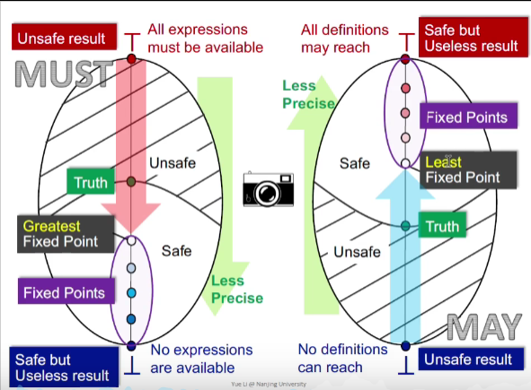

如何记忆？

1. 如何设置top和bottom（怕有的时候会反过来）？格中，bottom代表“所有人都不是坏人”，是Complete的，top代表“所有人都是坏人”，是sound的。也就是bottom - No，top - Yes。分析都是从unsafe到safe的。因为如果从另一头开始，结果就不会动了。所以Must analysis是从顶部unsafe 的“All Yes”，不断取交，增加No，直到剩下的都必定是yes。May analysis是从底部 unsafe的“All No”，不断取并，增加Yes，直到所有的Yes都在范围里。都是从最危险的地方开始，向最安全的方向走，半路上停下来，有种危险的感觉。


### 结果有多精确

路径汇聚起来的时候就Meet（/join）起来这种策略，称为MOP（Meet-Over-All-Paths Solution）。我们为Path，一系列的路径定义Transfer Function，$F_P$，为路径上一系列的transfer function的函数迭代。

某个基本块S_i的MOP指的是从Entry到达S_i的每一条路径的转换函数，输入Entry的OUT值后的最小上界。
$$
MOP[S_i]=\mathop{\sqcup/\sqcap}\limits_{A\ path\ P\ from\ Entry\ to\ S_i} (F_P(OUT[Entry]))
$$
而有一些Path可能是真实情况下不会被执行到的，所以我们的结果不是完全精确的，不是truth。而有一些循环是可能无数次的，不可枚举的，枚举所有情况是不可能的。

##### 我们的迭代方法 vs MOP的方法

我们的方法和MOP的方法的明显区别在于，MOP的meet是在最后进行的，而我们可能会提前meet结果在待入下一步的转换函数。

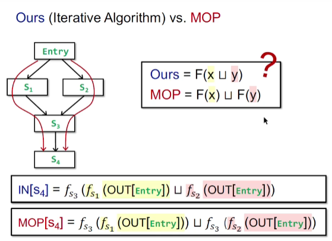

接下来证明$F(x\sqcup y)$（我们的）和$F(x) \sqcup F(y)$（MOP）的关系：$F(x) \sqcup F(y) \sqsubseteq F(x\sqcup y)$，即$MOP \sqsubseteq Ours$。

1. 由F的单调性可得$F(x) \sqsubseteq F(x \sqcup y)$ 并且 $F(y) \sqsubseteq F(x \sqcup y)$。
2. 由$F(x) \sqcup F(y)$的最小性，得证$F(x) \sqcup F(y) \sqsubseteq F(x\sqcup y)$。

当函数F满足分配性(distributive)的时候MOP = Ours，此时一样准。而我们之前遇到的Bit-Vector or Gen/Kill problems（用并集和交集操作的）转换函数F都是满足分配性的。而我们下面的这个例子就是不满足分配律的。

仔细想想，MOP代表着程序（在真实场景中）所有可能执行的路径的每种情况都考虑了进来。如果出现了不确定的循环，那路径数量直接变成正无穷。而我们通过在控制流交汇处提前合并，通过将分析结果合并提前到路径叠加之前，类似于运算符交换顺序，极大地降低了复杂度，使得分析变得可行。

### Constant Propagation-常量传播

定义：给定变量x，判断在点p处x的值是否一定是某个常量。

每个节点的OUT值，此时保存的是(x,v)的pair，表示此时某变量可能的值。

特殊的地方：

1. Lattice：我们不知道V可能取什么值，而我们只关心是否只会取一个值，于是我们设计域为UNDEF -> 具体值 -> NAC。这样length为3的lattice。

2. Meet Operator的情况：另外是设计Meet Operator的时候，当UNDEF遇到具体值的时候，我们认为结果是具体值。其实这里是特殊情况，如果编译器给了所有变量初始值比如0的时候，就甚至不存在UNDEF这样的值。这里感觉像把UNDEF作为未定义行为，不保证有稳定的结果。   或者说我们这个pass不管使用未初始化变量的错误，专注于当前优化，这个错误由前面的pass来查，这样就不会出现这种情况。

3. 转换函数：kill比较简单，如果x被赋值，就kill掉x的pair。gen比较特殊，如果是由其他变量赋值给x，如`x=y`，定义val函数，表示取当前y相关的pair的value值。此时`gen={(x,val(y))}`。如果是`x=y op z`的情况，需要分情况：

   1. 当val(y)和val(z)都是常量的时候，x = val(y) op val(z)
   2. val(y)和val(z)有一个是NAC时，x=NAC
   3. 否则x=UNDEF。这里也是边界情况吧。如果UNDEF和一个常量得到一个常量的话，这个函数就不是单调的了。TODO：为什么

   如果不是赋值语句，就直接传下去就好了。

##### 为什么不满足分配律

提前合并可能导致下面这种情况失去精度，因为NAC+NAC也有可能是Constant的。

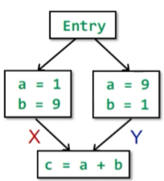

这里还可以看出我们的分析是单调的。

### Worklist 算法

真正的数据流分析中，往往不是用上面讲的迭代算法，而是这里的Work List算法， 相当于是迭代方法的一个优化。

我们的迭代算法每次OUT变了，就要重新遍历整个CFG中的基本块。其实只需要遍历真正需要更新的基本块，即被本轮OUT变化影响的基本块，这些基本块的IN可能变，从而他们的OUT可能变。

```c
OUT[entry] = 空集;
for (每个除了entry的基本块 B) {
    OUT[B] = 空集;
}
往Worklist加入所有基本块
while (Worklist非空) {
    从Worklist选取基本块B;
    old_OUT = OUT[B];
    IN[B] = 每个B的前驱（P）的OUT[P];
    OUT[B] = gen_B 并(IN[B] - kill_B);
    if (old_out != OUT[B]){
        把B的所有后继节点加入Worklist。
    }
}
```


## 实验一 constprop

Constant Propagation应该是must analysis。（D，L，F）中，Direction应该是Forward。Lattice是三层的那个。Transfer Function就是注意gen和kill。

关键是

1. 回忆Must analysis初始值应该是危险的Top“all yes”，（所有变量都是常量）然而这里是UNDEF，而Bottom是“all no”即NAC。
2. 由1就可判断，三层lattice中，undef和NAC谁在上谁在下了。NAC在下。另外初始化的时候需要初始化为UNDEF。

2. merge函数。之前的分析都是每个变量1bit，然后采取交或者并。而我们现在每个变量对应一个数值，合并的情况自然是定义新的运算，由于是must analysis，这里称作交，因为不同的数值合并的时候倾向于全零的bottom，NAC。
3. 控制流合并的时候是meet（交） operator，binaryOperation的合并是function f。不同之处在于如果运算的两个参与的数都是常量，则返回运算后的结果。而不是NAC。不是两个值相等的时候就返回这个值。

先实现meetValue，再实现FlowMap meet，再实现computeValue，最后transfer。

需要理解的地方：

1. transfer函数中changed变量指的不是out关于in是不是changed，而是本轮的out关于上一轮的out是否变化了。
2. Map函数的copyFrom函数调用的是put，会覆盖原来的值，并且会返回boolean表示是否修改了。


### 参数作为NAC还是UNDEF？

参数的Jimple语句是`p := @parameter0: int`，`JIdentityStmt`类型，属于`DefinitionStmt`。且左边的p属于`Local`。因此右边的`getRightOp`函数的值会传入`ComputeValue`函数。

右边的`@parameter0: int`属于ParameterRef类型，不属于几种我们处理的类型，因此被默认的条件处理，返回NAC了。


## 实验二 Dead Code Elimination

基于实验一的constprop，分析跳转的条件，找出可达的分支。通过标记出可达代码，去除不可达的部分。通过找出live variable，去除dead variable。

首先将实验一的代码复制过来，完善ComputeValue函数，处理其他几种boolean运算。并不是ConstProp自己用到，而是接下来实现的findUnreachableBranches调用这个方法计算condition是不是常量。

接下来就可以实现findUnreachableBranches函数，遍历分支，把不可达的边找出来。

再实现findUnreachableCode函数，遍历图找出可达节点，然后取补集得到不可达节点。

然后实现live variable，

最后实现dead code elimination。


### 为什么Soot用Box包裹Value？

References in Soot are called boxes。

TODO


### live variable

首先复习live variable analysis。这里使用reversed CFG，从而还是使用旧框架，流入的还是叫IN，流出的还是叫OUT。

live variable方向为reversed，属于may analysis，初始化为bottom而不断上升。每个变量用1bit表示live还是dead，bottom表示全部dead。控制流汇集的时候就使用并。

回忆gen和kill是什么：使用gen，赋值kill。重点考虑 `v=v-1` 先use再def，和 `v=2;k=v` 先def再use的情况：后面这种是两个赋值语句，属于正常范围。而前面这种类似于`t=v-1;v=t;`倒着考虑就是先kill后gen。所以处理赋值语句的时候需要先处理赋值，再处理右边的表达式。此外还要注意changed变量设置得对不对。

记得处理IfStmt，顺便处理了InvokeStmt和AssignStmt中的InvokeExpr。


## 07-Interprocedural Analysis

有了过程间分析，就不必对函数的返回结果做最保守的假设，比如函数结果作为NAC。从而增加精度。

基本的思想是增加call edge和return edge。我们这里关注的是面向对象语言OOPL（java）的调用图构造方法。有Class hieracy analysis(CHA) Rapid type analysis(RTA) Variable type analysis(VTA) Pointer analysis (k-CFA)这几种方法，依次速度越来越慢，但是越来越精确。我们本次课学第一个方法。

### Java中的方法调用

| -               | static call  | special call                           | Virtual call                      |
| --------------- | ------------ | -------------------------------------- | --------------------------------- |
| 指令            | invokestatic | invokespecial                          | invokeinterface<br/>invokevirtual |
| Receiver object | no           | yes                                    | yes                               |
| 目标方法        | 静态方法     | 构造函数，私有实例方法，父类实例方法等 | 其他实例方法                      |
| 相关方法数量    | 1            | 1                                      | >=1                               |
| 确定性          | 编译时确定   | 编译时确定                             | 运行时确定                        |

virtual call在C++里面是通过虚函数表实现的，子类可以修改表中的函数指针，指向重载的方法。因为即使把receiver object看作是父类的对象，对它调用某个方法我们也希望调用到子类的方法，所有关键是让子类的方法先于父类的方法调用。

构造调用图的关键在于Virtual Call。Soot中使用下面这种格式的"signature"：`<C: T foo(P,Q,R)>`。Virtual call调用的时候，基于1. receiver object的真正类型-c。2. 调用处的method signature-m。我们设这一过程为Dispatch(c,m)。调用处的m之所以不准确，因为如果c是m中类型的子类，又重载了它的方法，就需要调用c对应的方法。
$$
Dispatch(c,m)=
\begin{cases} 
	m' & c中非抽象方法里有1.相同名字\ 2. 相同descriptor的方法 \\
	Dispatch(c',m), & otherwise
\end{cases}
\\
c'是c的父类
$$
[descriptor和signature的区别](https://stackoverflow.com/questions/7526483/what-is-the-difference-between-descriptor-and-signature)：descriptor反映参数和返回值，不含名字。signature反映名字和参数，不包含返回值。

dispatch的公式描述了查找策略，就是从子类开始，不断向上找同名同descriptor的方法。

### Class hieracy analysis

`A a = ...;a.foo()`既然我们不知道会调用到哪个子类的方法，那就假设可能会调用到任何一个子类中的对应方法。

分析情景：假设我们在Soot中遇到了一个invoke称为cs，参数有一个"signature"称为m：`<C: T foo(P,Q,R)>`，如果是virtual call还会多一个Receiver object。Class hieracy analysis的Call Resilution算法描述如下：

```c
Resole(cs) {
    T = {};
	m = cs指令的“signature”参数;
    if cs is a static call {
        T = { m };
    }
    if cs is a special call {
        定义C^m为m的class信息;
        T = { Dispatch(c^m,m) }
    }
    if cs is a virtual call {
        c = cs的receiver object在声明的时候的类型;
        对c的每个子类 c'（包括c自己） {
        	往T添加Dispatch(c',m);
        }
    }
}
```

如果是static call，则直接可以找到对应的方法。如果是special call有三种情况，其中私有方法，自己的构造函数，则就是签名中的m，第三种情况是父类的方法（super关键字），这种情况需要不断回溯，因此我们统一也使用Dispatch函数来处理。（这里可以发现Dispatch的参数c^m是编译器确定的，因此返回的结果也是编译期能够确定的。）

这里是从那个变量声明时的类型向下找每个子类可能调用到的方法，而jvm运行的时候使用dispatch是从当前真正的类型向上找定义的方法，这就说明了对声明为C的类型的变量调用virtual call，那么被调用的函数所在的类，在继承树上最高不会超过C，最低不会低于变量真正的类型。错了，可能会高过C，但是此时C肯定也“有”这个方法，结果会等于Dispatch(C,m)。

CHA的优点：速度快，只考虑声明时的信息，但是忽略了数据和控制流的信息。缺点：不精确。很容易引入过多的目标函数。之后会通过指针分析的方法改善。

### CHA构造全程序的调用图

我们从出发点开始构造（main函数）。有点类似树（图？）的遍历。从entry开始遍历所有的invoke指令，然后不断加入边，把发现的新方法加入处理队列。

<font face="Consolas">BuildCallGraph($m^{entry}$)<br/>	WL=[$m^{entry}$], CG={}, RM={}<br/>	**while** WL 非空 **do**<br/>	**if** m $\not \in$ RM **then**<br/>		把m加入RM;<br/>		**foreach** m中的每个invoke语句cs **do**<br/>			T = Resolve(cs)<br/>			**foreach** T中每个函数$m'$ **do**<br/>				向CG中加入边 `cs -> m'`;<br/>				向WL中加入$m'$;<br/>	return CG;</font>

### Interprocedual CFG-过程间的控制流图

把所有的CFG放到一起，然后加入call edge和return edge。return edge指向call之后的下一条语句。没有栈保存返回地址，那return到谁？通过Context-sensetive的分析可以解决，把数据流分开。如果有多个target，则会有多个call edge和return edge，这里也有merge的情况。如果有递归函数，则类似之前过程内分析的循环情况，还是一样的分析，沿着边走，直到值稳定下来。

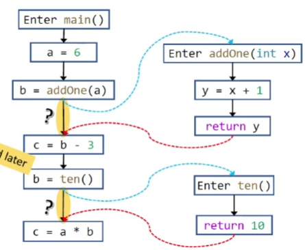

这里我们保留调用语句指向下一条语句的边，用于传递函数自己的local数据流。让call edge代表参数的流动，return edge代表返回值的流动。call的时候kill掉被赋值的变量，让它的值随着return edge流回来。


## 实验三 CHA

### 遍历invoke-interface和invoke-virtual的不同

在resolve invoke interface的时候，是否需要遍历子类？应该不需要，因为getAllImplementersOfInterface的时候应该就增加了所有的子类了？

那要不要考虑subinterface？？

### 从InvokeExpr中获取调用出变量的class

原本是

```java
SootClass current = method.getDeclaringClass()
```

表示该方法定义所在的class。但是在下面这个例子里，返回的是A。

```
public class VirtualCall {
    public static void main(String[] args) {
        B b = new B();
        b.foo();
    }
}

class A {
    void foo() {}
}

class B extends A {}
```

但是其实b的定义处的类型是B，我想要从B开始向下遍历类，通过调试搞出了下面这样的代码：

```java
SootClass current = ((RefType)((InstanceInvokeExpr)invoke).getBase().getType()).getSootClass();
```

VirtualInvokeExpr和InterfaceInvokeExpr这两个interface都是InstanceInvokeExpr的subInterface。多了getBase这个方法获取Local类型的变量（b），然后用getType，强转为RefType，调用getSootClass得到类型（b的类型B）。

但是这真的是正确的答案吗？感觉不应该这么复杂的。。。如果是从A开始遍历子类确实容易遍历到是A的子类而不是B的子类的类型。


### 观察Intra-和Interprocedural constant propagation

```
    public static void main(String[] args) {
        int a, b, c;
        CHACP x = new CHACP();
        a = 6;
        b = x.addOne(a);
        c = b - 3;
        b = x.ten();
        c = a * b;
    }
```

确实能够优化到addOne函数和ten函数。


## 08-指针分析

CHA的一个重大问题就是如果是interface，则所有implement了这个interface的类都可能是目标。OO中的指针分析分析的就是某个类的变量，指向的到达是什么实例。指针分析的是指向的对象的性质，更应该叫指向分析。指针分析几乎是静态程序分析的基础。Dagstuhl Seminar 2013的对指针分析的研讨会里这么说。

指针分析：计算一个指针可能指向哪些内存地址。它是一种may analysis，可以over approximation。

而别名分析分析的是两个指针是否会指向同一个值，它则不怎么关系指针的范围，所有指针分析和别名分析还是很不一样的。而别名分析可以由指针分析结果推导出来。

### 指针分析的关键要素

| Factor                     | Problem          | Choice                        |
| -------------------------- | ---------------- | ----------------------------- |
| 堆抽象                     | 对堆建模         | Allocation-site/Storeless     |
| 上下文敏感性               | 对调用上下文建模 | Context-sensitive/insensitive |
| 控制流敏感Flow sensitivity | 对控制流建模     | Flow-sensitive/insensitive    |
| 分析的scope                | 分析哪些部分     | 全程序分析、按需分析          |

上下文敏感技术，不同位置向同一个函数发起的调用，这个函数会分开分析。这个技术对指针分析效果提升非常显著。

流敏感：如何对控制流建模。我们之前的分析全都是数据流敏感的，需要对程序中每个点维护一个结果。流不敏感的方法则非常粗略，相当于只要可能指向就加过来，不管是程序中哪个点。目前Java中的很多分析都是Flow insensitive的。

Flow insensitive，意味着无需考虑程序中复杂多样、数量无限的数据流，另外也意味着我们的分析的结果是程序中所有的语句按照任意顺序执行的所有结果的上界。

### 堆抽象

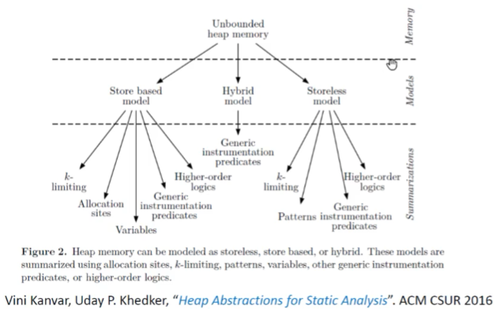

我们只学习最常用的Store based model中的Allocation-site技术。表示为每个创建点创建一个对象，即使创建点在循环里，被执行了多次，但是都抽象成一个对象。

### Java中的指针分析

Java中有四种指针，局部变量，静态域（全局变量），实例成员，数组元素。数组元素建模为一个能指向多出的域，忽略index。取出的时候也是忽略index。

接下来的分析都是Flow-insensetive的。我们只需要关心会影响到值的语句，不需要考虑所有语句。需要关系的语句有1. new `x = new T()`2. Assign `x = y`3. Store `x.f =y`4. Load `y = x.f`5. Call `r = x.k(a, ...)`。其中最复杂的是Call里面三种情况中的Virtual Call

## 09-指针分析基础-1

### 处理简单语句

程序中所有指针包括变量域V，和成员域$O\times F$两部分：
$$
Pointers = V \cup(O\times F)
$$
其中O代表所有的对象，由于采取了Allocation-site的方式，对象的数量在编译期就确定了。F代表了所有的成员组成的域，因此所有的实例域就是O和F的Product。

指向关系 pt：是Pointer到O的幂集的有序对：同时引入pt(p)函数表示p的指向集合。
$$
pt = Poniter \rightarrow \mathcal{P}(O)
$$

1. New语句：对于`x = new T()`，$\overline{o_i \in pt(x)}$表示将$o_i$加入x的指向的集合里。这里$o_i$既表示某个对象，又表示的是allocation site。

2. Assign语句：对应`x = y`，有$\frac{o_i\in pt(y)}{o_i\in pt(x)}$，表示所有是y的指向范围的值，也都是x的指向范围。意味着x的指向范围大于y。

3. Store语句：`x.f = y`，有
   $$
   \frac{o_i\in pt(x),\ o_j\in pt(y)}{o_j\in pt(o_i.f)}
   $$
   表示把x指向范围中每个值，的f域都做一遍Assign的操作。这范围有点大啊。

4. Load：`y = x.f`，有
   $$
   \frac{o_i \in pt(x),\ o_j \in pt(o_i.f)}{o_j \in pt(y)}
   $$
   x指向范围内的每个值的f，它们的指向范围全部合起来放到y的指向范围里。还是有点大...

### -------------课程视频没了-----------

伤心

### Pointer Flow Graph (PFG)

以上只是规则，并没有给出具体的算法。我们面临的相当于约束求解问题。我们用图组织描述出数据间的依赖关系，这样当某个数据变化的时候就可以沿着图更新被依赖的数据。

指针流图PFG是有向图。$Pointers=V\cup(O\times F)$ 作为Nodes。边，则是$Pointer \times Pointer$上的值。

| Kind   | Statement   | Rule                                                      | PFG edge        |
| ------ | ----------- | --------------------------------------------------------- | --------------- |
| New    | x = new T() | $\overline{o_i \in pt(x)}$                                | 无              |
| Assign | x = y       | $\frac{o_i\in pt(y)}{o_i\in pt(x)}$                       | $x\leftarrow y$ |
| Store  | x.f = y     | $\frac{o_i\in pt(x),\ o_j\in pt(y)}{o_j\in pt(o_i.f)}$    |                 |
| Load   | y = x.f     | $\frac{o_i \in pt(x),\ o_j \in pt(o_i.f)}{o_j \in pt(y)}$ |                 |

New语句需要将对应Allocation site加入x的指向范围，但是不引入依赖关系，因此对PFG没有影响。Assign语句`x=y`蕴含着无论y内有什么，都也要放到x内。因此每当y更新，也要更新x。而x变化却不会影响y。因此需要加入y指向x的边。Store语句和Load语句，增加了取属性的这个不确定的操作，因此采取保守策略，对每个可能被指向的对象，取f属性，执行Assign的操作。例如`x.f = y`就是对任何x可能的对象，加入y的值，因此需要y指向每个x可能指向的对象的f属性。                                

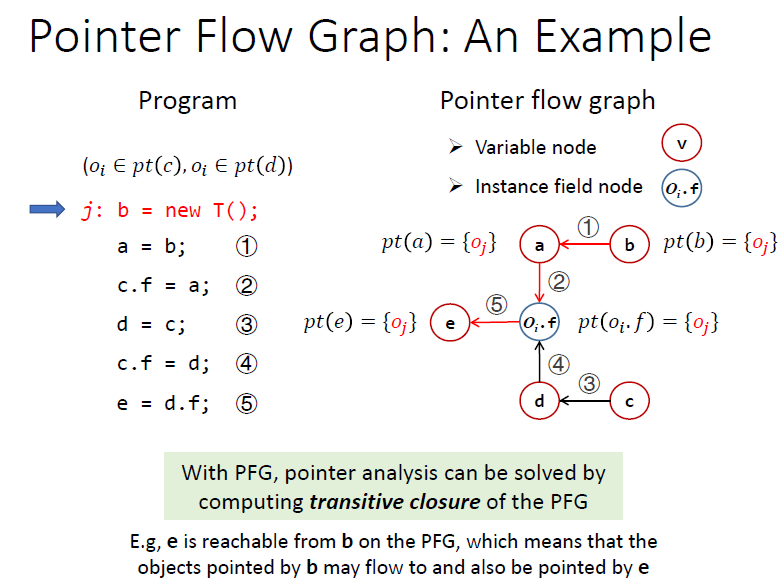


 ~~TODO:如何理解这里的$O_i.f$。我觉得拆开更好吧。设$O_i \in pt(c)$，设$O_k \in pt(d)$。由于$pt(c)\subseteq pt(d)$，因此会存在属于d而不属于c的部分。所以应该单独拆出来一条边，$O_k.f\rightarrow e$，这样更全面。ppt的写法多增加了a指向属于d而不属于c的部分的边，但我们是May analysis，多增加依赖关系只是会扩大范围，可以接受。ppt中的$O_i.f$应该是合并起来了对所有f的域的引用节点。~~

这里没必要太看懂，继续往后学就好了。之后会为每个Allocation site的object的每个域建立节点的。

### PFG上流动指向信息

指向信息可以顺着PFG流动，从而就直接获得了所有的指向关系pt。

然而这一过程和PFG的构建是相互依赖的。

### 算法

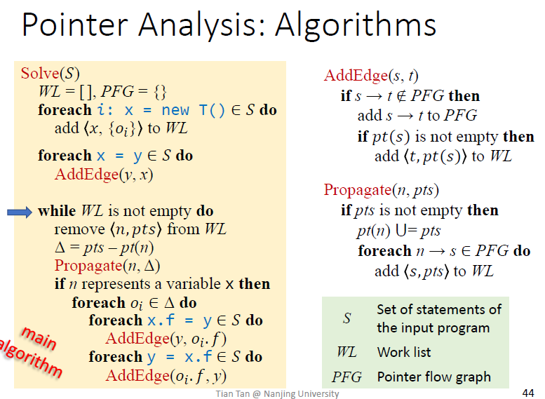

之后学Datalog处理指针分析的时候我被震惊了，为什么我花大力气学的算法居然能被这种通用的引擎处理。我们之前学习了指针分析的规则，只需要填入初始数据，然后根据规则推导出最终结果即可，复杂之处在于各种规则间互相依赖，根据规则更新了这个数据又影响了那个数据，又要更新。仔细想想，这个算法的本质，就是处理规则间的互相依赖的关系，即当一个数据更新的时候会影响到其他什么数据，不断处理达到最终结果。

首先介绍工作的数据结构：PFG，保存依赖关系。S，程序中所有的语句。指向关系的增加通过Propagate函数中的pt(n) 并等于运算增加，也就是说最终还是反映到pt，这个算法内部没写出来的数据结构内。

WorkList WL最特殊。每当某个指针需要增加指向的元素的时候，都要组成pair先放到WL里，有点递归的感觉。它是一个List，元素类型为(pointer, pts)，其中pts是指针需要增加的指向的目标。即$WL \subseteq <Pointer,\mathcal{P}(O)>$。

Solve函数中的处理工作队列的循环，就是负责处理某个指针需要增加元素的情况，也就是负责让增加的元素在PFG上流动，同时处理属性f TODO。

结合Assign分支理解AddEdge函数：1. 去重：如果边已经存在，则直接返回。2. 让指向集合顺着PFG流动一步，不过也只是先加入工作队列。

主体函数Solve，首先处理掉了所有的普通变量Assign，和New语句。New语句：填了一些工作队列。Assign语句：向PFG中增加了普通变量关系的边，注意此时不会向工作队列增加新的内容，因为pt还是空的。

##### Differential Propagation

工作队列循环，取出一个需要增加的pointer，对象集合的pair，然后找出真正增加的delta，调用Propagate函数，Propagate函数首先把增加的放到pt，也就是最终的结果集合中，然后找出受影响被更新的变量加入工作队列。这里只找出delta的技术称为Differential Propagation。

这里Worklist的工作方法来看应该是广度优先的。虽然可能Worklist内还是会有冗余，但是在每次处理的这个关卡把住，去除掉重复的，那就能减少很多工作量。

##### Store and Load

来到WL工作循环的后半部分。忘掉执行顺序，把各种语句当作一条条约束需要理顺。这个for循环其实就是描述的一种约束关系：当某个变量的指向增加的时候，1. `x.f = y`和`y = x.f`中的`x.f`会出现新的节点，需要增加PFG的边。

当给一个变量x增加了新的指向可能性的时候，我们开始处理相关的Store和Load情况。第一次执行到此处的时候，pt刚刚从空增加了x对应的对象。其他情况则是x增加了delta内的指向关系。对于delta内的每一个值，我们开始处理x的属性语句，对每个`x.f = ?`和`? = x.f`，我们需要假装每个delta里的对象是o_i内的元素，然后像Assign一样调用AddEdge。

理解`if n represents a variable x then`：这里if什么时候会不成立？当是属性的时候就不成立。1. 属性增加指向的时候意味着Store指令，即`x.f = y`这种形式，而不会是Load（`y= x.f`）。2. 我们处理的是3AC，不会有连续的取属性存在`x.f1.f2`。 => 这意味着某个变量的属性增加指向的时候，不会增加PFG的依赖关系。一方面`x.f=a`和`a=x.f`这两种语句的依赖关系已经被处理过了，另一方面不会存在`x.f1.f2=a`和`a=x.f1.f2`这样的语句。

总体来说就是多次取属性的操作会被临时变量拆分开。例如`b = new T(); a = b.f; c = a.f`，处理到具体Object（Allocation site）节点的邻居也就是b节点的时候会先增加$T_1.f$节点和$T_1.f\rightarrow a$，    **TODO**。

是处理某个节点的时候增加和这个节点相邻的节点和相应的边吗？不完全是。处理`x.f=y`这样的语句，就是为o_i.f增加节点和指向它的边。毕竟不能在程序中直接写`o_i.f`这种，因为程序又不是基于Allocation site的，所以必然会有`x.f=y`这样的x，代表各种allocation site。于是在x增加指向的时候，就需要处理对应属性节点的增加。此外，还会增加`e=x.f`这样的数据边，从而增加e这样的新变量。

如何结合Java的分析来理解？我们现在是Context insensitive的。把每个局部变量加上类和函数的前缀做区分，应该就对应着我们的Variable？

TODO：多对着例子自己推导几遍。多把公式总结几遍。

### 总结

1. 所有New
2. 所有Assign
3. Loop：
   1. Propagate：增加指向 -> 流动一步
   2. 遍历Δ × {Store, Load} 执行Assign操作


## 10-指针分析基础-2

本节课的任务只有一个：掌握跨函数的指针分析的算法。

对于语句`r = x.foo(a1, a2)`，公式基本上是说，如何解决参数指向，如何解决this指向，如何解决返回值的流向。特别注意this指针，不添加PFG边，而是直接暂时传过去？TODO

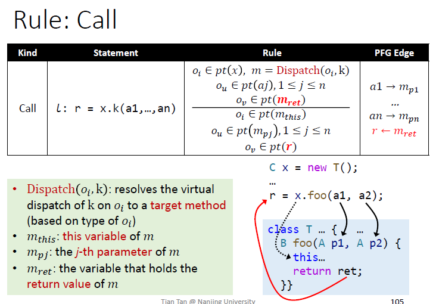

### 公式分析

公式可以拆分来看，把相同的元素如O_i先看条件中关于O_i的部分，再看结论中关于o_i的部分。

1. $$
   \frac{o_i\in pt(x), m = Dispath(o_i,k)}{o_i \in pt(m_{this})}
   $$

   因为Allocation site的Object是真实的，所以每个o_i也是真实的，不再需要像CHA那样猜测每个子类。所以Dispatch一次就可以得到真正被调用的方法。

   这个公式给出了method的查找方法，以及this指针的指向。

2. $$
   \frac{o_u \in pt(aj), 1\le j\le n}{o_u \in pt(m_{pj}), 1\le j\le n}
   $$

   这个比较直观？描述了argument传递变成parameter。即
   $$
   a1\rightarrow m_{p1},a2\rightarrow m_{p2},...,an\rightarrow m_{pn},
   $$

3. $$
   \frac{o_v\in pt(m_{ret})}{o_v\in pt(r)}
   $$

   也简单，描述了函数返回值的指向传递给调用处接收的变量，即$r\leftarrow m_{ret}$。

### PFG不增加x->m_{this}

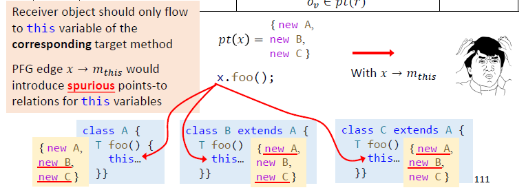

PFG中增加边表示的是依赖关系，`m_this = x`，如果增加了，那x的所有可能指向都会流向那个函数的指针，如图中，画横线的部分是明显不合适的，因为this指针不可能是那个类型。

从公式的角度讲，关键在于m是依赖于o_i取值的。也就是先外层遍历o_i，确定了o_i的具体值之后，才能确定m，从而让此时的m_this会指向o_i。如果增加PFG边，则当o_i确定了后，pt(x)中的其他值也可能是this的指向，这明显不对。

所以虚线代表什么意思？表示需要分情况考虑，x中只有部分值能够流过去。只有Dispath后确实会返回该method的o_i才会沿着虚线流过去，即$for\ o_i\in pt(x), if\ m == Dispath(o_i,k)$。

而如果方法是静态的，那么就没有this指针。

是否是Context-sensetive了？不，每个method只考虑了一次，而并不是随着每次调用考虑。

### 算法

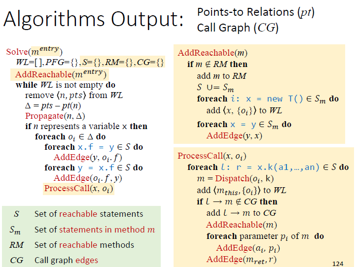

ProcessCall就是增加一个foreach处理call的语句。call语句其实就是一个“大型”拓展CFG和赋值的语句。同时算法增加了从entry函数开始的探索方式，不可达的函数不会被分析，最终生成Call Graph

给节点增加指向的时候要考虑沿着PFG的流动，因此要先加入工作队列，进行复杂的操作。那给当前可达语句集合增加一整个新函数的语句的时候，是否会对已有的结果产生影响？一方面由于函数作用域导致其他函数中的变量不会影响到这个函数，另外，不会增加已有的两个节点之间的边，因为`g1.f = g2.f2`这样的语句会被临时变量拆分开。所以增加一个可达函数的时候只是普通地处理New和Assign语句一次性解决，让新的边随着节点的增加而增加，不像增加指向的时候那么麻烦。

当某个变量的指向增加的时候，1. `x.f = y`和`y = x.f`中的`x.f`会出现新的节点，需要增加PFG的边。2. call调用的目标会增加：当x的指向范围更新了，那么此处就可能有新的方法被调用。因此像处理Load和Store一样，继续处理相关的call。有点类似`y= x.f`，但是拓展成了一整个函数。

算法和公式是对应的，算法的处理步骤为：1. 由于o_i已经确定，通过Dispatch计算得到m。2. ~~增加当前o_i到m_this的边。~~给m_this增加指向范围o_i到WorkList。这条边是独立于当前情况的，而之后的边都是每个（调用点，目标方法）只需要添加一次的。3. 判断是否加入Call Graph（同时去重），没有则加入Call Graph，AddReachable并增加参数传递边，增加返回值传递边。

### 总结

初始化新函数“大陆”AddReachable：不在可达函数列表则：加入可达函数列表，语句全部加入可达语句，处理New语句：增加队列，处理Assign语句：加边，流动。

处理调用语句：依次处理可达语句中所有的x.k：1. Dispatch找到m，增加m_this的指向范围到队列。2. 若次处调用不在CallGraph（当前的（调用点，目标函数）对是新出现的）则：一. 增加CallGraph。2. 初始化新函数大陆。3. 加入参数边和返回值边。

总算法：1. 初始化entry函数大陆 2. 进入工作循环：

1. 获取当前工作，计算Δ

2. Propagate：增加指向pt -> 流动一步

3. 遍历Δ × {Store, Load, Call}。其中Store和Load作为Assign处理：加边，流动

   Call指令单独处理。

加入可达语句列表是为了接下来遍历变量x的Store, Load, Call的时候会在里面找。由于变量都是局部变量（非局部变量都是域，需要先保存到局部变量），所有基本上只要在当前函数找行了？

普通函数调用怎么处理？是采取内联？不，应该只是call语句的不需要this指针的特殊情况。`r=x.f()`是在处理x的时候处理，但是静态函数调用没有x这样的对象，应该在初始化时处理参数和返回值的传递。


## 实验四

确实和讲的算法很对应。

1. 回忆几种语句的规则处理

2. 回忆几种数据结构

   利用PFG指针流图辅助，最终的目标是计算pt。

   其他辅助的数据结构：WL work list，S reachable statement，RM reachable Method，CG call graph。

3. 回忆算法流程

   主循环把关好节点指向的增加，把指向沿着PFG传播。增加edge的时候也需要传播。传播由worklist负责。

代码量挺小的。


## 11-12-Context-Sensetive 指针分析-1

不同的调用上下文中变量有不同的值，当C.I.的时候，会被混合并传播，进而形成假的数据流。

### 不同的上下文

1. Call-Site Sensitivity：调用链作为上下文标识。衍生：k-Limiting Context Abstraction
2. Object Sensitivity：Allocation site序列标识区分。衍生：Type Sensitivity。在类似Java这样的OO语言中，比Call-Site Sensitive的效果好。

call-site sensitivity是最古老的，最广为人知的方法。通过从entry开始的调用序列区分每次调用，仿佛每次执行到该函数的时候看一下backtrace区分不同的函数。在面向对象语言（如Java）中，Object Sensitivity通常比Call-Site Sensitivity表现更好。如果追求速度，可以进而选用Type Sensitivity。

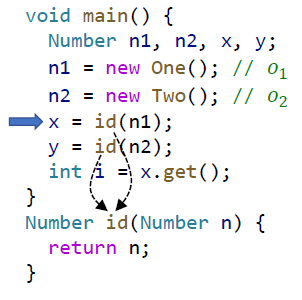

如图中，静态方法调用传参的时候，需要将两次调用区分开，否则数据流就会在同一个参数n上汇聚交错。

**Cloning-Based Context Sensitivity**

每个方法由context区分，每个context clone出来一个方法，仿佛是不同的方法似的单独考虑。而每个变量也继承方法的context标识，区分开。

### C.S. heap

Java这样的方法非常依赖堆。Context标识也同样需要应用到堆分配上，即Allocation site分配出的Object也要随着不同的Context区分开。想象有一个method专门用来分配对象，只有`return New A()`。则只有一个Allocation site。如果所有的这样分配得到的Object只用一个Object表示，则会导致数据流在这个Object的field上混在一起。

Context-Sensetive不仅需要对不同的调用点利用上下文标识区分开分析，还需要Context-Sensetive heap，区分在不同上下文中分配的对象。

然而C.S heap只有在C.S的时候才能提高精度。C.I.+ C.S. heap进行分析时，C.S. heap就不能提高精度了。因为。C.I.意味着不对函数做区分，C.S. heap意味着依然对New出来的object依照backtrace做区分。但是由于不对函数和变量做区分，导致即使分配出来的object不同，也直接在allocation site处被接收的临时变量混在一起，没有任何效果。

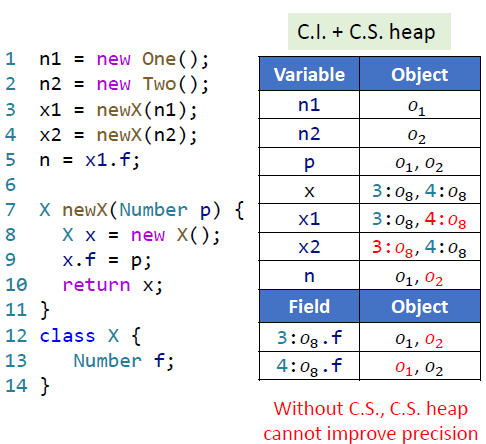

即图中虽然8行new X();返回了不同的对象，但是直接在变量x上混在一起，即使区分出来了对象，对它们做的操作也是完全相同的，多出来的对象没有任何效果。

C.S. heap和真正的堆的辨析： TODO

C.S. heap随着Context对调用链的区分而区分不同Context分配的对象。

还是无法区分单次函数调用多次分配的对象，即循环中的Allocation site的多次调用，Allocation site的固有限制。


### 公式

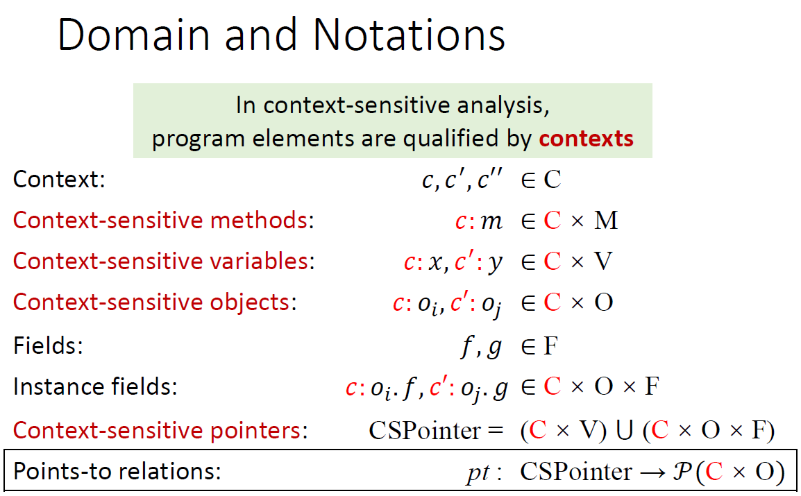

Fields不用加Context表示，是因为它所附属的Object已经有了Context标识，毕竟Fields不能单独存在。

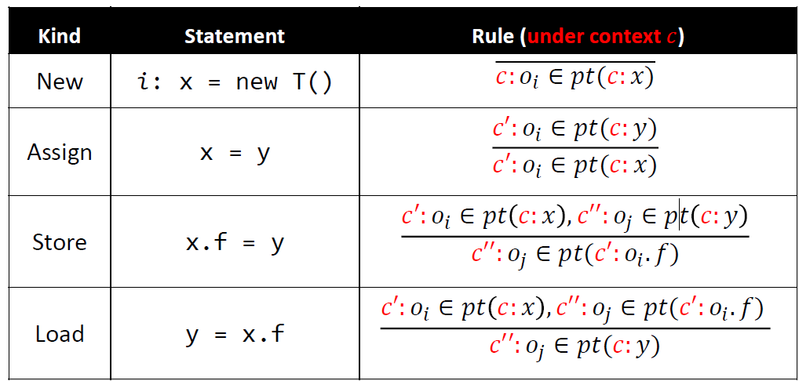

1. New语句：分配的Object的Context标记，和被赋值的变量一样，继承自当前函数调用的context c。
2. Assign：object的传递保持Context标识不变。寻找变量y的时候，找的是当前context的变量。
3. Store、Load：object的传递保持Context标识不变。c,c'和c''表示当前函数，x指向的某个object，和这个object的域可能指向的object的Context都可能不一样。

Call的公式如下：
$$
\frac
{c':o_i\in pt(c:x)，\\
m = Dispatch(o_i,k),\ c^t=Select(c,l,c':o_i)\\
c'':o_u\in pt(c:aj),1\le j\le n\\
c''':o_v \in pt(c^t:m_{ret})}

{c':o_i\in pt(c^t:m_{this})\\
c'':o_u\in pt(c^t:m_{pj})\\
c''':o_v\in pt(c:r)}
$$
和之前Call的公式差不多，先遍历o_i然后Dispatch得到m，传递this指针。传递参数和返回值。

但是call也是生成新的Context标记的地方。Select的参数如下：

1. 当前context：c。
2. call site的行号：l。
3. 调用的接收对象：c':o_i。

### 算法

PFG自此也是带context的，称为Pointer Flow Graph with C.S. 体现在节点是带context标记的（变量或对象的域）。加边还是一样的加，只不过对同一个方法可能会clone出各种只有context不同的节点。

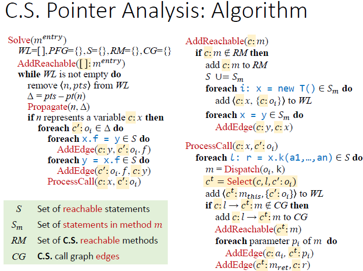

### Object Sensitivity

每次函数调用的时候，首先拿来receiver object的context作为基础，加上receiver object自身。由于我们是allocation site的堆模型，因此这里的object其实就对于allocation site。

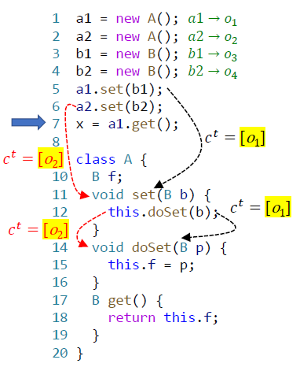

和Call-site Sensitivity对比：TODO

1. Object-sensetive还真就只关心Object。对同一个Object调用两次某方法无法区别。保持当前Object不变，把目标Object保存到域中，在另外一个方法里获取再调用，这样也无法区分。


有没有任意长Call-site无法识别，而object sensitivity能够识别的？

任意长Call-site能否完全区分object sensitivity的所有情况？


### Type Seneitivity

做实验才发现自己没弄清楚。

这是一种随着allocation增长的context。每次函数调用的时候，首先拿来receiver object的context作为基础，加上receiver object的allocation site这个语句所在的类。

类似于allocation的时候把所在的类拿过来增长一下，暂时存在object里，调用方法的时候拿出来。

context序列代表的是一路alloc的Object的语句所在的类型。

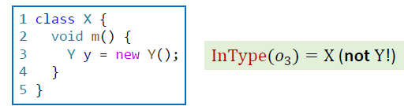

TODO：对比


## 实验五

Cloning-Based Context Sensitivity具体在代码中如何体现？在heap model和调用时生成标签中，返回了不同的object，则会在PFG和最终的pt上产生不同的节点，从而增加精确性。

指针分析的类实例化后，通过下面的方式设置了heap model和contex selector。我们需要的就是返回合适的context标记

```java
pta.setHeapModel(new AllocationSiteBasedModel());
pta.setContextSelector(new ContextInsensitiveSelector());
```

谁应该被包裹在context里面？根据实验指导，是Callsite、Obj、Type(Method.getClassType)。另外还有两点需要注意，call-site sensitivity对静态方法的处理和成员方法的处理相同。而对Object和Type sensitivity来说则是不额外处理，直接传递context。

例如实现k=2的情况，当context没有那么多的时候，还是需要实验DefaultContext和OneContext。

初始化entry函数的时候，当前的Context就是default context。

生成Context标记就是函数调用的过程。可以想象一个函数调用，可能是静态调用，有Method，Callsite，还可能是成员函数，这样还有receiver Object。

另外一个需要重视的地方就是Heap Context。CS分析对堆分配也需要区分开来。分配的堆对象需要带上调用的函数的标记。在callsite-s里，不关心object，所以堆对象的context没什么影响。在object、type里，。。。

callsite也带Context吗？语句的context是不是就是Method的Context？

sootclasses-trunk-jar-with-dependencies.jar里面为什么带了bam\*\*o，吓死人了，以为bam\*\*o真的是soot的组成部分。可能是实验不得不用，而不想暴露实验的答案吧。不过jetbrains真是厉害啊，直接反编译了。

最后被坑的原因是：每个k-limiting的context selector，heap context的limit是k-1。TODO：为什么


## 13-安全相关的静态分析


### 访问控制 vs 信息流安全

访问控制只是限制访问数据的对象，而信息流安全可以跟踪信息的处理，分配。感觉有点类似污点分析。

信息流，有点像指针分析里面的数据依赖关系PFG图。`x=y`这样就表示y的信息流向了x。

为信息分配密级，有点像访问控制，但不是访问的时候判断，拒绝，而是分析审计然后警报。

关键在于两点：

1. 把信息分成不同的安全级别

   复杂的级甚至可以是Lattice结构的，只有顺着图方向的流动才被允许。

2. 信息流动策略：不可影响策略

   高密级的变量不能影响到低密级的变量。

### 机密性和完整性

机密性保证秘密数据不会泄露，代表了不允许低密级Read高密级。完整性保证重要数据不会被篡改，代表高完整度不可访问低完整度。

直接赋值这样的情况属于显式流动。然而还存在隐藏信道（Covert Channels）。如：通过控制流影响其他变量，程序时间，触发异常等等信息。但是我们主要关注显式信道

### 污点分析+指针分析

常规的污点分析似乎是指动态分析。而我们静态分析通过充分理解程序从而理解程序动态运行的行为，也可以用信息流来做污点分析。污点分析是使用最广泛的信息流分析，既可以分析机密性的泄露，也可以分析完整性是否被部分数据影响。

首先将我们感兴趣的信息标记为Tainted，信息源称为source（如把一些函数的返回值设置为source），其他数据是untainted。我们标记危险的函数为sink。我们分析就是试图找出从source流向sink的可能的路径。

把Source作为Allocation site，把Tainted data作为(artificial)Object，作为所有Object中的一部分。并且增加新的生成tainted Object的规则和收集Sink函数参数指向的规则。然后基于指针分析进行推导。

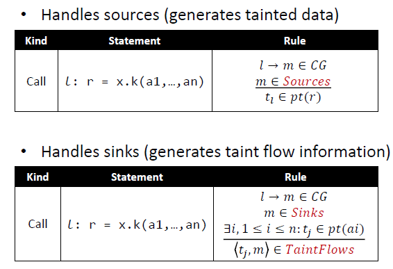


## 14 Datalog-Based program analysis

### 动机

如何让程序分析也能用描述式的方法，而不必关心具体实现？

### Datalog

是Prolog的一个子集。没有副作用，没有控制流，没有函数，不是图灵完备的。由数据表Facts和逻辑Rules组成。Datalog不断推导出数据，因此是单调的。而由于规则是`安全`的，因此总的结果是有限的，所以最终总能停下来。

Predicates意为（谓词、判断）。一个谓词对应一个关系，代表一个数据表。对谓词带上参数成为一个fact，代表对参数中数据属于表中的断言。

Atoms 是Datalog中最基本的元素，形如`P(X1,X2,...,Xn)`的称为relational atom。如果`(“Xiaoming”,18)`在表中，则`Age(“Xiaoming”,18)`为真。还有arithmetic atoms，如`age >= 18`这种变量判断。

Datalog Rules形如`H <-B1,B2,…,Bn.`，由Head，箭头，Body组成。意思是当body为true的时候Head也为true。其中`,`为与逻辑，`;`为或逻辑，`!`为非逻辑，复杂逻辑最好多加加括号。

考虑如下规则：

```
Adult(person) <- Age(person,age), age >= 18.
```

Datalog可能会遍历Age表赋值person和age变量，然后推导，得到每个Person的Adult是否为true。

谓词分为EDB（extensional database）、IDB（intensional database）。EDB为给定的数据，IDB是推导出的数据。

Datalog最关键的是支持递归：

```
Reach(from, to) <- Edge(from, to).
Reach(from, to) <- Reach(from, node), Edge(node, to).
```

### 规则安全性

A rule is safeif every variable appears in at least one non-negatedrelationalatom

每个变量至少要出现在右侧relational atom一次，被取反的不算。

为了防止自我矛盾：`A(x) <- B(x), !A(x)`，被取反的不能是当前被递归的。

### Datalog进行指针分析

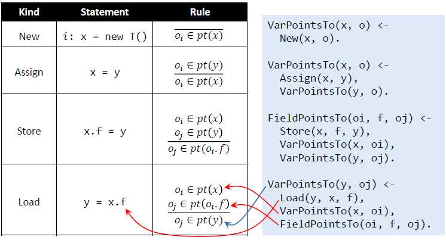

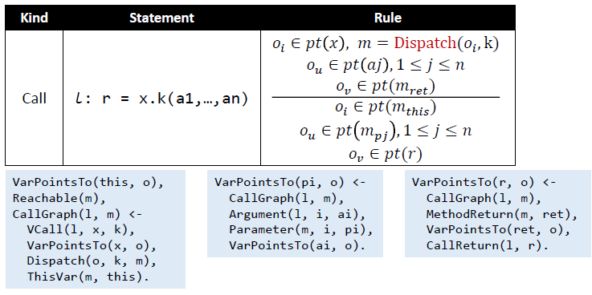

同理，函数调用也被拆分成了三个规则，分别处理this指针，参数，返回值。

### Datalog进行污点分析

在指针分析的基础上，增加Source表，Sink表，Taint表（call site -> tainted data）。最终推导出Taint Flow。

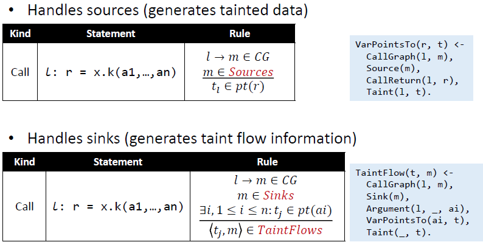

在指针分析的基础上处理好Source和Sink的情况。把Sink的情况收集起来。

### 总结

Datalog类似于我们把表格里的公式输入进去，而不管算法部分。

我们学习的算法的好处主要在于精确知道每一步推导对下一步推导的影响是什么。每一步都精确知道下一步该做什么，从而提升效率。


## 15 Soundness and Soundiness

Soundness关注的是能完全包含真正程序运行的所有可能行为。而实际生活中很难实现。难点如下：

1. Java：反射，native汇编代码，动态类加载
2. JavaScript：eval函数，DOM等
3. C/C++：指针的运算，函数指针

这些特性过于灵活，强行加以分析只能过度估计，导致过于不精确的结果。因此非专业人士可能过度相信结果（在sound core上的），专业人士也无法精确解释分析结果到底有多准确。

### 避开的方法

1. sound core：部分特性能够Sound分析，特定部分或者太难分析的部分会 under-approximate。提取出适合的作为语言的sound core。
2. 难以分析的特性考虑采取临时策略。

### Soundy

soundy的分析能在unsound处理部分特性的基础上，尽可能抓住所有程序可能的行为。unsound的分析是为了速度或效率等因素，存在忽视部分unsound的行为。

### Java Reflection

最难处理的特性。如果碰到了不分析，肯定会损失一些函数调用、变量赋值。

1. StringConstantanalysis+PointerAnalysis：如果class名，method名，field名是静态字符串，则可以进行分析。
2. TypeInference+Stringanalysis+PointerAnalysis：调用点看看有没有已知类型的参数（借助指针分析），缩小被调用方法的范围。另外看返回值如果被强制类型转换通过返回值类型推断。getFiled操作通过object的类型，也可以通过返回值的强制类型转换。setField操作通过object类型和传入的类型判断。
3. Assisted by Dynamic Analysis：custom class loader。

### Native code

感觉native code，除了实现功能，操作起java来就是reflection式的操作。

1. 手动对关键native代码建模：分析时使用Java代码模拟、描述JNI的效果。
2. BinaryScanning


## 16 CFL-Reachability and IFDS

一方面通过定义Realizable的路径，通过识别并去除un-Realizable的路径，CFL-Reachability，达到了函数调用路径匹配的效果，而不需要Context-sensetive。 TODO CFL-Reachability不太懂

另外学习怎么构造Exploded Supergraph，构造出来就可以发现，可以将部分程序分析问题表达在图上，通过图可达性解决程序分析问题。

### 函数调用流匹配

回忆Meet-Over-all-path，是将所有可能的路径找出，依次计算每个路径，再合并。在函数调用过程中的调用边和return边匹配，导致走return边的时候只有一条真正路径`RealizablePaths`，其他的并不是真正可执行的路径。

这种调用边导致的问题，可以通过类似括号匹配的算法识别不对的路径并避免。这里引入context-free language，若某路径在该语言中，称为有CFL-Reachability。调用边作为左括号，加上特有标号，只和同样标号的return边匹配。中间可以有任意的普通边。这里识别的是任意点到任意点的路径，不一定是完整的路径，因此可能会留下待之后被匹配的左括号。

```
realizable -> matched realizable
-> (_i realizable
-> ε
matched -> (_i matched )_i
-> e
-> ε
-> matched matched
```

### IFDS(Interprocedural,Finite,Distributive,Subset Problem)

IFDS处理跨函数的数据流分析，在有限域上，基于distributive的flow function。提供meet-over-all-realizable-paths(MRP)的结果。主要步骤：

1. 构建super graph$G^*$（即带call边和return边）
2. 根据需要分析的问题，定义edge的flow function
3. 构建exploded supergraph $G^\#$，将流函数转换为graph。TODO
4. 将需要分析的问题Q通过图可达性解决：在$G^\#$ 上用Tabulation algorithm。


Path function 记作 $pf_P$，是某条path p上所有Flow Function的复合。
$$
pf_P=f_n\circ...\circ f_2\circ f_1
$$
MOP和MRP的区别就在于只取了部分realizable的path。
$$
MOP_n =\mathop{\sqcup}\limits_{P\in Paths(start,n)} pf_p(\bot)
$$

$$
MRP_n =\mathop{\sqcup}\limits_{P\in RPaths(start,n)} pf_p(\bot)
$$

### Supergraph

$$
G^*=(N^*,E^*)
$$

将每个函数的flow graph $G_1,G_2,...$放在一起，每个唯一的入口点为$s_p$，唯一的出口点为$e_p$。每个函数调用点设置node为call node $Call_p$，return的点设置node$Ret_p$。

每个函数调用有三条边：

1. call-to-return-site edge：$Call_p$到 $Ret_p$的短边
2. call-to-start edge：$Call_p$到$s_p$的调用边
3. exit-to-return-site edge：$e_p$ 到$Ret_p$的返回边。

最后要给每条边加上lambda函数，首先明确研究的问题

我们定义研究的问题是未初始化的变量被使用的问题。S表示为初始化的变量集合。初始的时候设置为所有变量：`λS.{x,g}`，每次初始化变量`x=0`就删去对应的变量：`λS.S-{x}`。

加上lambda函数的要点：

1. 虚线（调用边和返回边）不传递当前的局部变量，只传递参数（和全局变量）。由call to return 小短边传递局部变量。全局变量也从call边流入，让未初始化的全局变量从return边流回。
2. 调用边的lambda函数需要将传入的参数重命名。返回边需要删去离开作用域的局部变量
3. 使用已有的变量运算需要注意未初始化变量的污染性，运算如果有未初始化值参与，结果也是未初始化的。

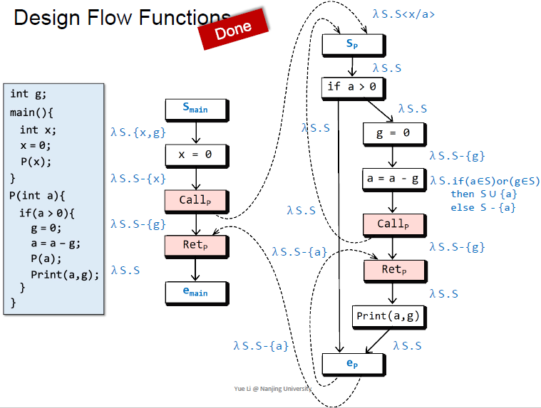

### exploded supergraph

representation relation $R_f$指的是之前讲到的lambda函数的关系形式的表示，用于构建Exploded Supergraph。Exploded Supergraph将原有的Supergraph的每个节点变成（"explode into"）D+1个节点，每条边变成对应λ函数的关系表示而得到的巨大的图。

1. 边merge的时候怎么办？当然是直接将输出使用同一套节点，此时节点会被多次指向。这差不多是并运算吧。

#### representation relation

D+1个输入节点，D+1个输出节点。关系就是这（D+1）×（D+1）上有序对的集合。
$$
R_f = \{(0,0)\} \qquad Edge: 0 \rightarrow 0 \\
\cup \{(0,y)|y\in f(\phi) \} \qquad Edge: 0 \rightarrow d_1 \\
\cup \{ (x,y)\ |\ y \not\in f(\phi)\ and\ y \in f(\{x\}) \} \qquad Edge: d_1 \rightarrow d_2
$$
公式含义：

1. 首先一定有（0，0）边。
2. $f(\phi)$指即使输入空集（从0节点进入）也能增加的元素。即gen。 TODO check
3. $f(\phi)$和$f(\phi)$之外的元素分开考虑。意味着如果存在（0，y1），则不会有其他元素也指向y1。
4. 接下来看$f(\phi)$之外的元素，是否存在输入x的时候的输出$f(\{x\})$是对应的y，有则加入（x,y）边。
5. 可以发现，去掉某个元素时（kill），则没有任何边指向它（以它为终点）。

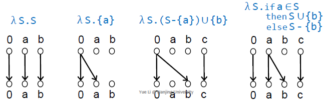

#### Flow Function表达data fact

看单个flow function的图，如果能走到下方的某个点，则表示此处的OUT包含它。

TODO

1. 为什么traditional flow function不能复合到一起？
2. 将多个连接起来的图中入口到出口的可达关系，压缩成单个图，就是将多个flow function复合起来？

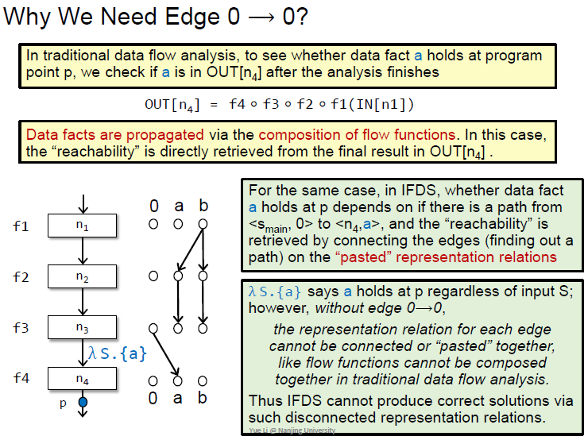

此外，此时再回顾之前unrealizable的path的识别，就会发现派上用场了。不只要可达，还要realizable。因此该问题也不是简单的图可达性问题。


#### Tabulation Algorithm

如果存在realizable路径，从<s_main,0>到<n,d>，则表示在n这点处有d这个data fact，此时d会被涂成蓝色。而且提供的是MRP的方案。

简单来说：从起始点开始，把可达的点标记成蓝色。不详细学习算法

1. 处理返回的时候，需要找到对应的调用边返回
2. 第一次处理的时候将函数调用总结成一个summary edge。（把整个函数的调用到结束点的可达关系总结起来？？TODO）之后再次调用相同函数的时候复用结果
3. 可达的点都标蓝

### Distributivity

1. 能否做常数传用（constant propagation）？它是之前那个比较特殊的，域是无限的。那我只考虑有限的常量可以吗？NO

   TODO

2. 能否做指针分析？NO

Distributivity（分配性）：F(X^Y) = F(X) ^ F(Y)。

仔细想想flow function的图表示，可以发现无法表示both逻辑，即需要两个输入同时成立，才会成立结果。

如果需要多个input data facts得出一个新的结果，则此时该分析就不满足分配性，不能用IFDS。因为IFDS将每个data fact，和它的传播（每个edge）分开单调考虑了。

思考题：

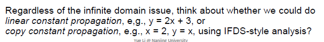

TODO

#### IFDS与指针分析

看下面的例子：

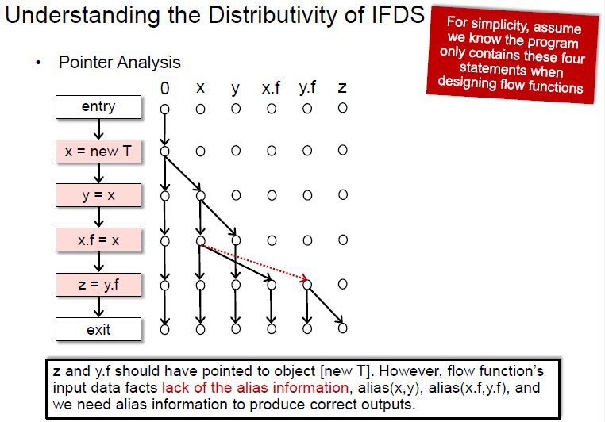

这个例子说明通过IFDS进行指针分析的致命问题是别名信息。假设x和y是别名，为了得到正确的结果，需要同时考虑x和y，因此最后分析起来还是不满足分配律的。

TODO